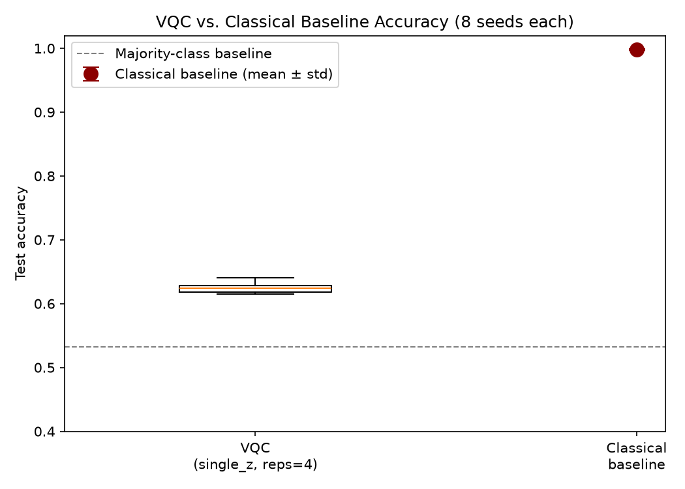
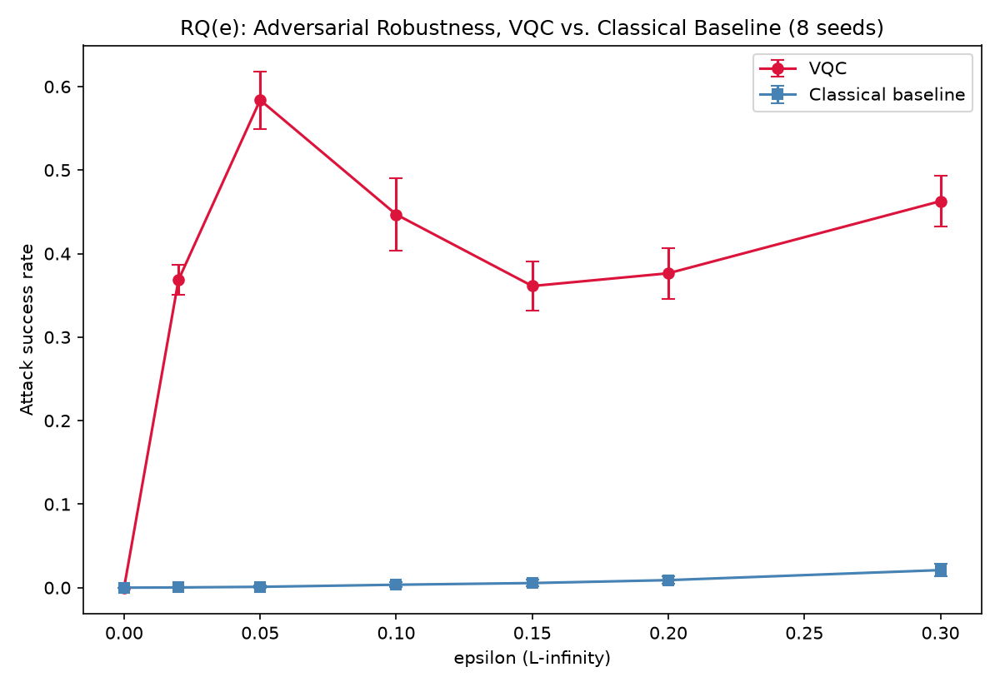
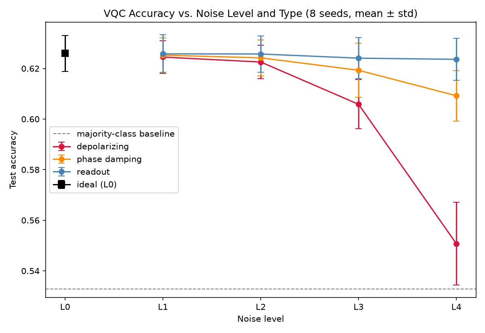
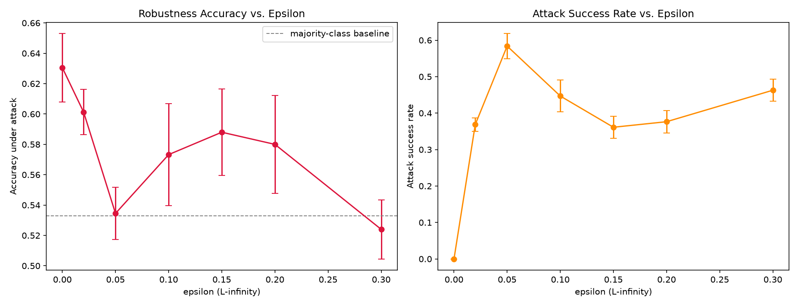
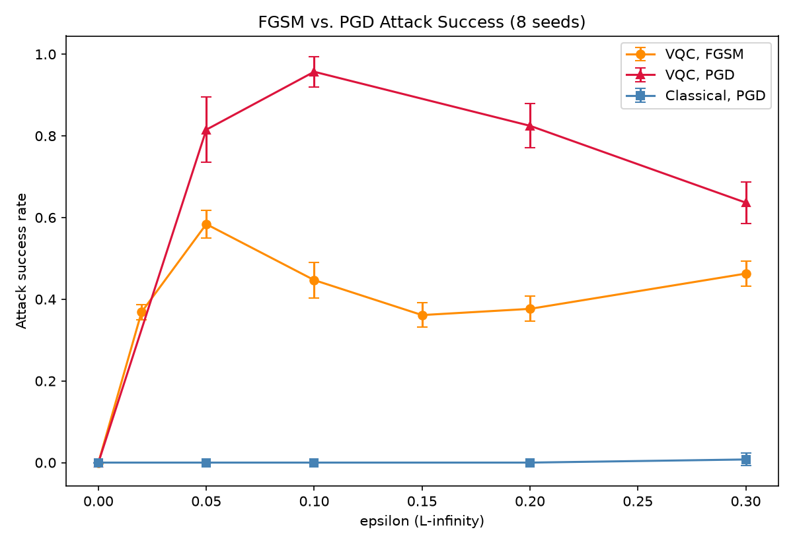
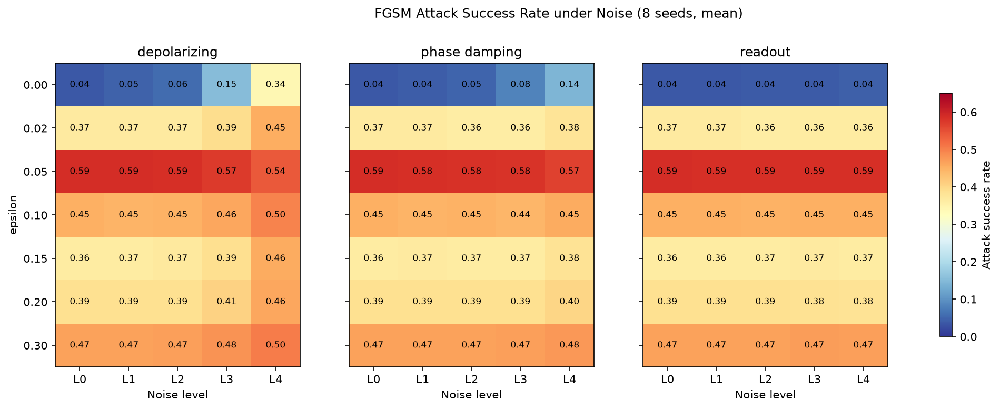
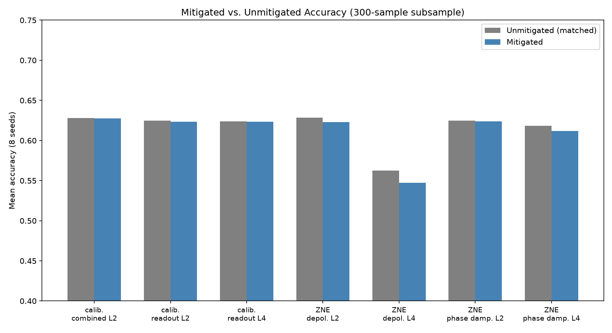
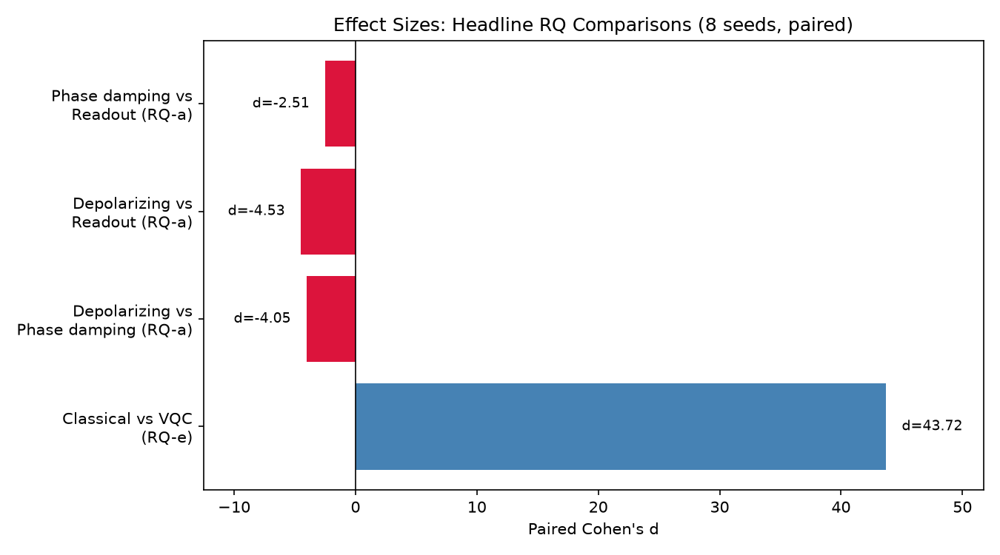

# Experimental Analysis of Adversarial Robustness in Variational Hybrid Quantum-Classical Machine Learning Models Under NISQ Noise

*Draft, restructured to the department thesis template. All six chapters are now drafted against real results: the full 01–10 notebook pipeline (data through statistical analysis, including the PGD extension and the mitigation sweep) has been run. The Abstract below is a working draft; it should still get one more pass once the whole document is final, per the template's own advice, but it now reflects the actual numbers rather than a placeholder shape.*

---

# ABSTRACT

**Background.** Variational hybrid quantum-classical models are the leading near-term candidate for practical quantum machine learning, but they have to run on noisy intermediate-scale quantum (NISQ) hardware, where depolarizing errors, decoherence, and readout mistakes are simply part of the deal. Whether that noise ends up helping or hurting a model's adversarial robustness is still an open question, and one the literature has only just started to answer [1].

**Objectives.** This thesis asks how NISQ noise affects the adversarial robustness of a variational quantum classifier (VQC): (a) which of three noise types — depolarizing, phase damping, readout — matters most; (b) how attack success rate changes as noise gets worse; (c) how clean accuracy and robustness relate to each other under noise; (d) whether inference-time mitigation (zero-noise extrapolation, readout calibration) helps; and (e) how the hybrid model holds up next to a matched classical baseline.

**Methods.** A 4-qubit VQC (`ZZFeatureMap` + `RealAmplitudes`, reps=4, Qiskit 2.5.1) and a parameter-matched classical feedforward network were trained on binary (0-vs-1) MNIST reduced to 4 principal components, across 8 seeds each. FGSM adversarial examples were generated via the Adversarial Robustness Toolbox against the clean, noiselessly-trained VQC and evaluated, unchanged, under three simulated NISQ noise channels (depolarizing, phase damping, readout) at four severity levels; PGD was added as a stronger secondary attack. Two inference-time mitigation techniques (readout calibration, zero-noise extrapolation) were tested against a matched unmitigated baseline. All comparisons used paired Wilcoxon signed-rank tests (paired t-test as a secondary check), paired Cohen's d, and Benjamini–Hochberg FDR correction across seeds.

**Results.** The VQC reached 62.46% mean test accuracy (± 0.85 points, 8 seeds) against a 99.83% classical baseline on identical data (d = 43.7, p < 0.001): a large, deliberate gap traced to a bounded expressivity ceiling in the circuit family used (Chapter 3), not an implementation defect. Depolarizing noise degraded accuracy far more than phase damping, which in turn degraded it far more than readout error (at the strongest level: 55.1% vs. 60.9% vs. 62.4%; all pairwise d > 2.5, FDR-corrected p < 0.001), a systematic effect on the decision function rather than a shot-noise artifact. FGSM attack success against the VQC followed a non-monotonic curve across ε, peaking at 58.4% at ε = 0.05; PGD showed this understated the model's real vulnerability, reaching 95.7% success at ε = 0.1. Composing noise with attack revealed a dual effect: depolarizing noise increased attack success at most epsilons but decreased it specifically at ε = 0.05, the model's most vulnerable point; the same dual character was reported for a single noise channel across different datasets in the closest related work, but appears here within one model as a function of attack strength. Neither mitigation technique significantly improved robustness in any of 7 tested conditions (all FDR-corrected p ≥ 0.73). Clean accuracy and adversarial robustness across the noise grid were not significantly correlated (r = 0.27, p = 0.14). On both accuracy and robustness, the classical baseline dominated the VQC under FGSM (d from −9.9 to −20.3) and PGD (d from −10.2 to −25.5).

**Conclusions.** Within this scope, NISQ noise's effect on adversarial robustness is neither simply protective nor simply harmful: it depends on noise type and, for the strongest channel, on attack strength specifically, which argues against single-number "noise helps/hurts robustness" claims. Clean accuracy and robustness under noise behave as partially independent properties rather than one tracking the other. Standard inference-time mitigation, as implemented and tested here, did not recover any of this robustness. And on a task easy enough for a lightweight classical network to solve almost perfectly, the hybrid model was both less accurate and substantially less robust, a genuine cost with no observed compensating robustness advantage, at least at this scale and for this architecture.

**Keywords:** quantum machine learning, adversarial robustness, NISQ noise, variational quantum classifier, error mitigation

*[Check the keyword list against the final title before submission: the template allows at most 2 of the 5 keywords to overlap with the title, and both "quantum machine learning" and "NISQ noise" brush up against the current title wording.]*

---

# DATA AVAILABILITY STATEMENT

The code developed for this thesis — preprocessing scripts, the VQC and classical baseline definitions, the Phase 0 diagnostics module, experiment configs, and the noise, attack, mitigation, and statistical-analysis modules (`src/noise/`, `src/attacks/`, `src/mitigation/`, `src/analysis/`) — will be available at the project's GitHub repository: **[TODO: insert final repository URL]**.

MNIST itself is public and pulled directly from OpenML (`sklearn.datasets.fetch_openml("mnist_784")`), so it isn't redistributed here, but the scripts needed to regenerate the exact binary (0-vs-1), 4-PCA-feature dataset used throughout, including the fixed train/test split and the corrected scaler fitting order, are included.

Trained checkpoints (`results/models/`) and the full set of result tables and figures referenced throughout Chapter 4 (`results/classical/`, `results/training_history/`, `results/noise_sweep/`, `results/stability_sweep/`, `results/fgsm_sweep/`, `results/classical_fgsm_sweep/`, `results/pgd_sweep/`, `results/noise_attack_sweep/`, `results/mitigation_sweep/`, plus the top-level `results/*_summary.csv`, `results/rq_e_*.csv`, and `results/*.png` files) are included too, so every number cited in this thesis can be checked without retraining or rerunning anything.

**Still to do before submission:**
- Archive a tagged release to a repository with a permanent identifier (Zenodo or figshare are the usual choices here), and swap the GitHub link above for that DOI.
- Add a license file.
- Check with my supervisor whether any part of this needs to be restricted, and if so, note which parts and why.

---

# ACKNOWLEDGMENTS

*[Add acknowledgments here.]*

---

# CONTENTS

ABSTRACT
DATA AVAILABILITY STATEMENT
ACKNOWLEDGMENTS
CONTENTS

1. INTRODUCTION
   1. Background
   2. Problem Statement and Scope
   3. Outline
2. RELATED WORK
   1. Background: Quantum Machine Learning on NISQ Devices
   2. Adversarial Robustness in Classical Machine Learning
   3. Adversarial Robustness in Quantum Machine Learning: State of the Field
   4. Noise as a Double-Edged Sword
   5. Error Mitigation in NISQ-Era Quantum Machine Learning
   6. Positioning of This Thesis
   7. Chapter Summary
3. METHOD
   1. Research Questions
   2. Dataset and Preprocessing
   3. Classical Baseline Design
   4. Variational Quantum Classifier Design
   5. Phase 0: Diagnosing an Initial Training Failure
   6. Noise Models
   7. Adversarial Attack Methodology
   8. Mitigation Methodology
   9. Statistical Analysis Plan
   10. Evaluation Metrics
   11. Validity and Reliability
   12. Summary of Finalized Experimental Configuration
   13. Software and Computational Tools
4. RESULTS AND ANALYSIS
   1. RQ(e): Hybrid VQC vs. Classical Baseline
   2. RQ(a): Which Noise Type Has the Greatest Impact?
   3. RQ(b): Noise Intensity vs. Accuracy and Attack Success
   4. Attack Methodology Results: FGSM vs. PGD
   5. Noise × Attack Composition and the Main Research Question
   6. RQ(c): Relationship Between Accuracy and Robustness
   7. RQ(d): Does Mitigation Improve Robustness?
   8. Summary of Findings by Research Question

   *(Table numbering in Chapter 4 runs 4.1–4.15 in reading order; see the section text for the full list.)*
5. DISCUSSION
   1. The Dual Impact of Depolarizing Noise, Revisited
   2. Accuracy and Robustness as Partially Independent Properties
   3. Why FGSM Alone Would Have Been Misleading
   4. A Genuine Null Result: Why Mitigation Didn't Help
   5. The Hybrid Model's Double Disadvantage
   6. Revisiting Validity and Reliability in Light of the Results
6. CONCLUSION AND FUTURE WORK
   1. Answers to the Research Questions
   2. Contributions
   3. Limitations
   4. Future Work
   5. Closing

REFERENCES

*[The template numbers these as chapters 2–7, with chapter 1 reserved for the template's own Preface, which the template says explicitly to delete in the final version, so it isn't reproduced here. Renumber to match whichever convention your final document uses.]*

---

# 1. INTRODUCTION

## 1.1 Background

Quantum machine learning (QML) is one of the more heavily studied applications proposed for noisy intermediate-scale quantum (NISQ) devices. The basic argument behind it is that certain ways of encoding data into a quantum state give access to kernels or representations that would be difficult to simulate on a classical computer [6]. The workhorse architecture for testing that idea is the variational quantum classifier (VQC), where a parameterized quantum circuit is trained alongside, or in place of, a classical neural network layer. VQCs have stuck around mainly because they can be kept shallow enough to survive today's noisy hardware while still being optimized with ordinary gradient-based methods: via the parameter-shift rule, or by differentiating through a statevector simulator [8].

A separate and much older line of work asks a different question about machine learning models in general: how far does an input have to move, in some small and often imperceptible way, before a model's prediction flips? Classical deep learning has treated this question, adversarial robustness, as a serious concern for roughly a decade [10], [11]. Once QML models start getting proposed for real classification tasks, it becomes fair to ask whether they inherit the same vulnerability, sidestep it somehow, or behave differently in a way worth understanding in its own right. NISQ hardware adds a complication no purely classical model has to deal with: every current device carries its own noise, and that noise sits directly in the path of any attack against it.

This interaction cannot simply be averaged away. Depolarizing error from imperfect gates, decoherence such as phase damping, and readout error have all been described in recent work as something close to a double-edged sword for robustness. Noise can behave like an implicit regularizer, or something close to a differential-privacy guarantee, against gradient attacks that assume a clean, deterministic forward pass. At the same time it erodes clean accuracy outright, and whether it reliably blocks an attack seems to depend on the channel, its strength, and even the dataset [1], [20] (Section 2.4 discusses this dual-effect framing in more detail). Whether noise nets out as protective or harmful is an empirical question, not a theoretical one, and Chapter 2 lays out why the field has only recently started studying it with any rigor. As far as the literature search behind this thesis could tell (Section 2.6), no prior study has done so across more than one noise channel at once, alongside inference-time mitigation and a properly matched classical baseline.

## 1.2 Problem Statement and Scope

A few gaps stand out in the current literature on QML adversarial robustness:

- Most empirical studies of NISQ noise and adversarial robustness look at a single channel, usually depolarizing noise. Phase damping and readout error are left largely untouched, and it isn't obvious whether either would behave the same way.
- Very few studies check whether the mitigation techniques already used in NISQ pipelines (zero-noise extrapolation, readout calibration) change adversarial robustness specifically, rather than just clean accuracy.
- A fair, matched classical baseline is often missing or mismatched, which makes it hard to tell whether an observed robustness effect is something quantum-specific or simply what small, shallow models tend to do regardless of architecture.
- Statistical rigor (multiple seeds, paired significance tests) is applied inconsistently across the field, so it is often unclear whether a reported effect is real or an artifact of a single training run.

This thesis takes on that combination of gaps, but within a scope narrow enough to actually finish: a 4-qubit VQC on a binary, low-dimensional classification task, noise simulated rather than measured on physical hardware, and a bounded set of white-box gradient attacks. The narrowness here is deliberate: the goal is to make the full combination (multiple noise channels, an attack, mitigation, a classical baseline, multi-seed statistics) achievable within the time available, rather than attempting something broader and shallower. That gives the following research questions:

**Main research question.** How does NISQ hardware noise affect the adversarial robustness of variational hybrid quantum-classical machine learning models?

**Sub-research questions.**

- **(a)** Which noise types (depolarizing, phase damping, readout) have the greatest impact on adversarial robustness?
- **(b)** How does increasing noise intensity influence adversarial attack success rate?
- **(c)** What is the relationship between clean accuracy and adversarial robustness under noisy conditions?
- **(d)** Can inference-time noise-mitigation techniques (zero-noise extrapolation, readout-error calibration) improve adversarial robustness?
- **(e)** How does the hybrid quantum-classical model compare to an equivalent classical baseline in adversarial robustness?

Section 3.1 works through why each of these is answerable given the design laid out in the rest of Chapter 3, rather than a theme dressed up as a question.

**Contribution summary.** This thesis contributes five things: a controlled study of VQC adversarial robustness across more than one noise channel under a single evaluation protocol, which the literature search in Chapter 2 could not find a precedent for; an evaluation of two standard inference-time mitigation techniques for their effect on adversarial robustness specifically, not just clean accuracy; a classical baseline trained and evaluated on identical data with a comparable parameter budget, so the RQ(e) comparison is fair rather than mismatched; a multi-seed design with paired significance testing throughout; and a documented diagnostic investigation (Section 3.5) into an early VQC training failure, written up as a methodological finding rather than buried as an implementation detail.

## 1.3 Outline

Chapter 2 reviews the relevant literature (quantum machine learning, NISQ noise, and adversarial robustness in both classical and quantum settings) and positions this thesis against the closest existing work. Chapter 3 motivates the research questions and covers the dataset, the classical baseline, the VQC architecture, the diagnostic investigation behind the final VQC configuration, the noise/attack/mitigation/statistics methodology, and a discussion of how valid and reliable the design is. Chapter 4 reports the results of the full experimental pipeline, organized by research question rather than by notebook. Chapter 5 discusses what those results mean, particularly the epsilon-dependent dual effect of depolarizing noise and the null correlation between accuracy and robustness. Chapter 6 closes with answers to each research question, the thesis's contributions, its limitations, and directions for future work.

---

# 2. RELATED WORK

## 2.1 Background: Quantum Machine Learning on NISQ Devices

Variational quantum algorithms tune a parameterized circuit's parameters classically against some cost function evaluated on hardware or a simulator. They became the leading candidate for near-term quantum advantage largely because they can be kept shallow enough to survive NISQ-era noise budgets [7], [8]. A variational quantum classifier built from a data-encoding feature map (the `ZZFeatureMap` of Havlíček et al. is the standard example [9]) composed with a trainable ansatz such as `RealAmplitudes` and a Pauli-observable readout, is now a fairly standard architecture for supervised classification. Chapter 3 describes the version of it used in this thesis.

## 2.2 Adversarial Robustness in Classical Machine Learning

Adversarial examples (inputs nudged by a small, often imperceptible amount specifically to cause a misclassification) were first characterized systematically by Szegedy et al. [11] and Goodfellow et al. [10], the latter introducing the Fast Gradient Sign Method (FGSM) as a cheap, single-step gradient attack. Madry et al. later introduced Projected Gradient Descent (PGD), a stronger iterative version, and framed adversarial training as a min-max robust optimization problem [12]. Both are white-box, gradient-based attacks that need differentiable access to the model. That requirement matters directly for the noise-and-attack design used later in this thesis (Section 3.7): a shot-based noisy quantum circuit does not offer the deterministic forward pass these attacks assume.

## 2.3 Adversarial Robustness in Quantum Machine Learning: State of the Field

Adversarial robustness in QML has grown into enough of a subfield to have its own systematic mapping. A scoping review following PRISMA-ScR guidelines, searching four major databases, found **53 eligible empirical studies published between 2020 and 2026** on adversarial robustness in QML [2]. It found the field leaning heavily toward input-level evasion attacks against classification models like VQCs and quantum neural networks, most defenses adapted from classical adversarial training and noise-based mitigation rather than built to be quantum-native, real hardware deployment still rare, and, the point that matters most for the gap this thesis targets, a continuing lack of standardized benchmarking or hardware-validated, statistically rigorous, multi-seed evaluation [2].

A second, broader systematization-of-knowledge (SoK) paper widens this picture with empirical work across a much larger range of threat models: black-box label-flipping poisoning, gray-box backdoors (Huang-Zhang proxy triggers, QUID poisoning), and white-box circuit-level (QTrojan) and gradient-based (FGSM, PGD) attacks, on quantum multilayer perceptrons using both angle and amplitude encoding, against a classical MLP baseline [3]. It reports a real accuracy-robustness trade-off between the two encodings (amplitude encoding reaches higher clean accuracy but falls apart under adversarial perturbation and depolarizing noise, while angle encoding tops out lower but holds up noticeably better) and concludes that "noise is an asymmetric and unreliable passive defense" against several of the threat models it tests [3]. For positioning this thesis, the relevant detail is that this study's noise treatment is a single fixed depolarizing setting (p = 0.01) applied uniformly to gates: no phase damping, no readout error, and no mitigation evaluation [3].

A few other pieces of closely related work deserve a mention: Winderl et al.'s study of QNNs under depolarization noise, examining white-box attacks and defenses [18]; Gong et al.'s work on noise regularization and randomized encodings as a deliberate defense [19]; and the attack-transfer framing this thesis borrows for its own methodology (Section 3.7): generate the adversarial example against a clean model, then see how it holds up once noise is switched on at inference time, which follows earlier work on attack transfer under hardware noise by Winderl et al. [18] and West et al. [22].

## 2.4 Noise as a Double-Edged Sword

The single closest paper to this thesis asks exactly this question (is device noise a passive defense, or does it open up a new attack surface?) in a 2026 study published in *Entropy* [1]. It proposes a "noise-aware four-path evaluation protocol" separating the noise level assumed when generating an adversarial example from the noise level present at inference, and tests it on a 4-qubit VQC (the same qubit count used here) across four datasets under depolarizing noise up to p = 0.3 [1]. Its headline finding is that noise's effect on attack success is dataset-dependent and non-monotonic: more noise suppresses the attack on some datasets, which fits a passive-defense story; on others the attack still works at the highest noise level tested; and in a few cases a moderate, not maximal, noise level is where attack success actually peaks [1]. That result motivates a good part of this thesis. If the effect is already this sensitive to conditions within a single noise channel, comparing several noise *channels* under one consistent protocol, rather than one channel across several datasets, looks like the next useful step toward identifying which physical mechanism is driving it. Chapter 4, Section 4.4 shows this thesis finding the same dual character the Entropy paper reports across datasets, but within a single model and dataset, as a function of attack strength rather than which dataset is being classified: depolarizing noise mostly raises FGSM attack success as it increases, except specifically at the epsilon where the noiseless model is most vulnerable, where more noise instead suppresses the attack. Chapter 5 discusses what that different axis of the same phenomenon implies for the passive-defense question this paper raises.

Other adjacent work fits into a broader "noise as regularizer" story. Depolarizing noise has been argued to make NISQ classifiers something like inherently differentially private, and therefore naturally resistant to some adversaries [20], and deliberate noise injection has been studied as a defense in adjacent domains such as network intrusion detection [21]. Both make the noise-as-defense idea plausible in principle, but the Entropy 2026 result [1] and the SoK study [3] both show empirically that it does not hold consistently: precisely the ambiguity this thesis's multi-channel design (Section 3.6) is meant to help sort out, at least for a 4-qubit VQC on binary MNIST.

## 2.5 Error Mitigation in NISQ-Era Quantum Machine Learning

Zero-noise extrapolation (ZNE) amplifies circuit noise deliberately, through gate or pulse folding, then extrapolates back to the zero-noise limit. Temme, Bravyi, and Gambetta introduced it as a mitigation technique that needs no extra qubits, which is a large part of why it fits near-term hardware [13]. Readout-error calibration (correcting measured bitstring counts against a characterized confusion matrix for the measurement channel) is the other standard, cheap technique usually paired with it.

More recent work looks specifically at how well mitigation holds up across multiple noise channels for hybrid QNNs. One 2026 study tests five channels (phase-flip, phase-damping, depolarizing, and amplitude-damping among them) against four mitigation strategies (ZNE, Digital Dynamical Decoupling, Layerwise Richardson Extrapolation, and Probabilistic Error Cancellation) and concludes that "mitigation benefits remain limited and noise-dependent" [4]. A second, related 2026 study looks at how *classical* input-level noise (speckle, impulse, quantization, feature dropout) compounds with hardware-inspired quantum noise (depolarizing, amplitude damping, phase damping, Pauli errors, readout errors) in a VQC, and finds that classical-side noise makes the effects of quantum decoherence noticeably worse [5]. Neither paper touches adversarial robustness — both are strictly clean-accuracy-under-noise studies [4], [5]. That leaves entirely open whether the mitigation shown to help clean accuracy in [4] and [5] does anything for adversarial robustness specifically, which is what this thesis's RQ(d) asks directly.

## 2.6 Positioning of This Thesis

Table 2.1 lines this thesis up against the three closest studies identified above, on the dimensions that matter for the sub-research questions in Section 1.2.

**Table 2.1: Comparison against the closest related empirical studies.**

| Dimension | This thesis | Entropy 2026 [1] | SoK [3] | Mitigation studies [4], [5] |
|---|---|---|---|---|
| Qubit count | 4 | 4 | Not fixed (9-qubit PCA setting reported) | Not specified in abstract |
| Noise channels | Depolarizing + phase damping + readout (3, at 4 severity levels) | Depolarizing only | Depolarizing only (p = 0.01, fixed) | Multiple noise channels, but **no adversarial attacks** |
| Adversarial attacks | FGSM (ART), PGD if time permits | Not stated as ART-based; gradient attack + EOT-style | FGSM, PGD, plus poisoning/backdoor threat models | None |
| Inference-time mitigation | ZNE + readout calibration | Not evaluated | Not evaluated | ZNE (+ others), but not w.r.t. adversarial robustness |
| Classical baseline | Matched (same data/split, comparable parameter count) | Not reported | Classical MLP baseline present | Not clearly reported |
| Statistical design | 8 seeds, paired Wilcoxon + t-test, FDR correction | Not detailed in abstract | Not detailed in abstract | Not detailed in abstract |

This thesis is not the first study of adversarial robustness under NISQ noise: the Entropy 2026 paper already reports a dataset-dependent, non-monotonic result for one channel [1]. It is not the first broad map of QML threat models either, since the SoK study already covers that ground [3]. Nor is it the first to look at multi-channel noise mitigation for hybrid QNNs, which has already been done for clean accuracy [4], [5]. What this search could not find anywhere is all of it combined in one study — more than one noise channel, evaluated under an actual attack, with mitigation applied to the noise-plus-attack condition, against a properly matched classical baseline, with statistics that hold up across multiple seeds. That combination is the gap this thesis targets.

## 2.7 Chapter Summary

This chapter placed the thesis's research questions against a subfield that has only recently become formal enough to have its own scoping review (53 studies, 2020–2026 [2]), and against its three closest relatives: a single-channel noise/adversarial decoupling study [1], a broader multi-threat-model systematization [3], and two multi-channel mitigation studies that skip adversarial evaluation entirely [4], [5]. The combination this thesis targets — multi-channel noise, an actual attack, mitigation, a matched classical baseline, and multi-seed statistics, all in one study — appears to be genuinely open. Chapter 3 sets out how the methodology is built to fill it.

---

# 3. METHOD

## 3.1 Research Questions

The main research question and its sub-questions were stated in Section 1.2. Each is answerable, not just a restated theme, given the design laid out in the rest of this chapter:

- **RQ(a)** (which noise type matters most) is answerable because Section 3.6 fixes three distinct, independently parameterized noise channels under one identical protocol: the comparison Sections 2.3–2.4 show the literature has not made across more than one channel.
- **RQ(b)** (noise intensity vs. attack success) is answerable because each channel is swept across four severity levels (Section 3.6), giving a dose-response curve instead of a single noisy/noiseless comparison.
- **RQ(c)** (accuracy/robustness relationship) is answerable through the per-seed Spearman correlation design in Section 3.9, which avoids treating correlated points on the noise grid as independent observations.
- **RQ(d)** (does mitigation help) is answerable because Section 3.8 applies both mitigation techniques specifically to the noise-plus-attack condition and compares robustness with and without them, the comparison Section 2.5 shows is missing from the mitigation literature.
- **RQ(e)** (hybrid vs. classical) is answerable because the classical baseline in Section 3.3 is trained and evaluated on identical data with a comparable parameter budget, sidestepping the mismatched-baseline problem raised in Section 1.2.

**Alternative designs considered.** One option was to generate adversarial examples *adaptively* under each noise condition, rather than generating them once against the clean model and transferring them (Section 3.7). That would answer a related but different question, how a noise-aware attacker behaves, and was set aside as out of scope for this timeline: it means differentiating through a stochastic, shot-based simulation, a considerably bigger undertaking than the parameter-shift/statevector differentiation used here (Section 3.4). Running on real quantum hardware instead of Qiskit Aer simulation would strengthen external validity (Section 3.11), but queue time and cost make an 8-seed × multi-noise-level × multi-epsilon grid unrealistic within the time available, and that limitation is stated plainly rather than glossed over. Amplitude encoding instead of the angle-style `ZZFeatureMap` was also considered, given the SoK study's finding that encoding choice changes the accuracy/robustness trade-off substantially [3]. Angle encoding was kept because it matches the qubit-efficient, one-feature-per-qubit design already fixed in the approved proposal, and because amplitude encoding's noise sensitivity [3] would confound the noise-channel comparison (RQ a) with an encoding effect this thesis is not trying to measure.

## 3.2 Dataset and Preprocessing

The dataset is MNIST restricted to digits 0 and 1 [15]. This was a deliberate choice: the task becomes close to linearly separable after modest dimensionality reduction, and since the research questions here concern noise and adversarial robustness rather than classical task difficulty, a near-saturated classical baseline (Section 3.3) gives a stable reference point to measure degradation against.

**Pipeline:**

1. Full MNIST (70,000 samples, 784 raw pixel features) is loaded via `sklearn.datasets.fetch_openml("mnist_784")`.
2. Samples are filtered down to digits {0, 1} (14,780 samples) with labels remapped to {0, 1}.
3. An 80/20 stratified train/test split (`random_state=42`) gives 11,824 training and 2,956 test samples, with class balance preserved (≈53.3% class 1 in both splits).
4. Pixel values are scaled with `MinMaxScaler`, fit on the training split only and then applied to both. This fit-order was actually a fix: an earlier version of the pipeline fit the scaler on the full dataset before splitting, which leaks test-set statistics into preprocessing. The practical effect on MNIST pixel values is negligible, but the order was corrected anyway (see the project's git history).
5. PCA reduces the 784-dimensional scaled pixel space to 4 components (one feature per qubit, matching the VQC's `num_qubits=4`), fit on the training split only. On the binary subset, the first four components explain 54.8% of total variance (32.1%, 9.0%, 8.0%, and 5.7% individually).
6. A second `StandardScaler`, fit on the training split of the PCA-reduced features, is applied right before the data reaches either model, standardizing each of the 4 features to zero mean and unit variance. This is the representation both the VQC and the classical baseline actually see.

**Checking that the task really is easy.** Before touching either model, a plain `sklearn.LogisticRegression` and an `SVC(rbf)` were fit directly on the standardized 4-feature representation, reaching 99.66% and 99.90% test accuracy respectively. This confirms the 4-feature representation retains essentially all the information needed to separate the two classes, and it sets the ceiling both the classical baseline (Section 3.3) and the VQC (Sections 3.4–3.5) are compared against.

## 3.3 Classical Baseline Design

The classical baseline is a small feedforward network trained on exactly the same preprocessed data as the VQC (same PCA features, same split, same per-split standardization), so the RQ(e) comparison is fair rather than confounded by two different data pipelines. An earlier baseline, now archived, had been trained on the full 10-class, raw-pixel MNIST task by mistake and reached only 12% accuracy; it was not usable for this comparison and has been fully replaced.

**Architecture.** One hidden layer: `Linear(4 → 8) → ReLU → Linear(8 → 1)`, trained with `BCEWithLogitsLoss` and Adam (`lr=0.01`, 30 epochs, best-validation-loss checkpointing). The hidden width of 8 was chosen so the parameter count (49: 40 in the first layer, 9 in the second) stays roughly the same order of magnitude as the VQC's (22, Section 3.4): the idea being that any accuracy or robustness gap that shows up later shouldn't be explainable away as a capacity mismatch.

**Result (8 seeds, 42–49).** Mean test accuracy 99.83% ± 0.09% (precision 99.85%, recall 99.83%, F1 99.84%), matching the logistic-regression/SVM ceiling from Section 3.2. This is the number the VQC (Section 3.5) and the noise/attack sweep (Chapter 4) are compared against for RQ(e).

## 3.4 Variational Quantum Classifier Design

The VQC has three parts, built in Qiskit 2.5.1 and Qiskit Machine Learning 0.9.0:

**Feature map.** A `ZZFeatureMap`-style encoding circuit (`qiskit.circuit.library.zz_feature_map`, the function-based form that replaces the now-deprecated `ZZFeatureMap` class), `feature_dimension=4` (one feature per qubit) and `reps=2` [9]. It has no trainable parameters of its own; it just encodes the 4 standardized inputs $\mathbf{x} = (x_0, x_1, x_2, x_3)$ into a quantum state via the unitary

$$
U_{\Phi(\mathbf{x})} = \left(\exp\Big(i\sum_{j<k} x_j x_k \, Z_j Z_k\Big) \exp\Big(i\sum_j x_j Z_j\Big) H^{\otimes 4}\right)^{r},
$$

applied to the $|0000\rangle$ state, with $r = \texttt{reps} = 2$ repetitions. The pairwise $Z_jZ_k$ terms are what give the map its name and are the source of the entanglement between input features that a purely single-qubit encoding would lack.

**Ansatz.** A `RealAmplitudes` circuit (`qiskit.circuit.library.real_amplitudes`, again the function-based form), 4 qubits, linear entanglement: alternating layers of single-qubit $R_y(\theta_i) = \exp(-i\theta_i Y/2)$ rotations and fixed CNOT entangling gates between neighboring qubits, i.e. $U_{\text{ansatz}}(\boldsymbol{\theta}) = \prod_{l=1}^{r+1} \left(\bigotimes_{i=1}^{4} R_y(\theta_{l,i})\right) \cdot \text{CNOT-layer}_l$ (the final layer has no trailing entangler). `reps` is the key architectural knob here, settled in Section 3.5 at a final value of $r=4$, giving $(r+1)\times 4 = 20$ trainable rotation angles $\boldsymbol{\theta}$.

**Observable and QNN.** A single Pauli-Z observable on the last qubit (`observable_mode="single_z"`, `SparsePauliOp("ZIII")`), evaluated through an `EstimatorQNN` backed by a `StatevectorEstimator`: exact, infinite-shot expectation values during training, with noise deferred entirely to the inference-time sweep in Section 3.6. For input $\mathbf{x}$ and ansatz weights $\boldsymbol{\theta}$, the QNN computes

$$
f(\mathbf{x}, \boldsymbol{\theta}) = \langle 0000 | \, U_{\Phi(\mathbf{x})}^{\dagger} \, U_{\text{ansatz}}(\boldsymbol{\theta})^{\dagger} \; Z_3 \; U_{\text{ansatz}}(\boldsymbol{\theta}) \, U_{\Phi(\mathbf{x})} \, | 0000 \rangle \in [-1, 1],
$$

which is wrapped as a PyTorch module via `TorchConnector` (`input_gradients=True`, needed so FGSM/PGD can later differentiate through the quantum layer). This single scalar feeds a `Linear(1 → 1)` classical head, $z = w \cdot f(\mathbf{x}, \boldsymbol{\theta}) + b$, and the predicted class probability is $\hat{y} = \sigma(z) = 1/(1+e^{-z})$: 22 trainable parameters in total ($\boldsymbol{\theta}$'s 20 ansatz weights plus $w$ and $b$). Training minimizes binary cross-entropy over the batch,

$$
\mathcal{L}(\boldsymbol{\theta}, w, b) = -\frac{1}{N}\sum_{i=1}^{N} \Big[ y_i \log \sigma(z_i) + (1-y_i)\log\big(1-\sigma(z_i)\big) \Big],
$$

via Adam, with gradients with respect to $\boldsymbol{\theta}$ obtained through Qiskit's parameter-shift rule (the same differentiation path FGSM/PGD reuse at attack time, Section 3.7).

**A reproducibility bug, fixed along the way.** `TorchConnector` draws its default initial ansatz weights from PyTorch's *global* RNG, and the model-construction code's `seed` argument was only ever wired into `StatevectorEstimator`, not into weight initialization. Two "same-seed" model instantiations were therefore starting from different initial weights, not just different sampling noise: a real bug, not a minor quirk. The fix draws `initial_weights` explicitly from a local, seed-scoped `numpy.random.Generator`; a regression test confirms two instantiations with the same seed now produce bit-identical output.

## 3.5 Phase 0: Diagnosing an Initial Training Failure

Before any noise or adversarial experiment could mean anything, something more basic had to be sorted out first. An early VQC training run reached only about 58% test accuracy (barely above the 53.3% majority-class floor, with training loss stuck near ln(2) ≈ 0.693, which is exactly what you'd expect from random guessing) even though the same 4 features supported 99.66% accuracy under a plain logistic regression (Section 3.2). Since every sub-research question in Section 1.2 assumes a VQC that has actually learned something, this wasn't a detail to quietly tune away; it needed to be understood properly first. What follows is that investigation, reported in full rather than summarized down to just the fix, because the path there — including a wrong turn — is itself part of the finding.

The approach was to work through an ordered list of falsifiable checks, ruling out one explanation at a time, cheapest and most informative first.

**Step 1: Gradient flow audit.** A single forward/backward pass showed all three parameter groups (`quantum.weight`, shape (12,); `classifier.weight`, shape (1,1); `classifier.bias`, shape (1,)) getting non-zero gradients, which rules out a fully broken gradient path. One thing worth noting, though not conclusive on its own: `classifier.bias` got a noticeably larger gradient norm (0.194) than `quantum.weight` (0.022): a hint, not proof, that the optimizer might find it easier to shift the output bias toward the majority class than to actually use the quantum signal.

**Step 2: Optimizer registration check.** The optimizer was tracking all 14 parameters `model.parameters()` reports in the original (`ansatz_reps=2`) configuration, so nothing was silently frozen.

**Step 3: Tiny-subset overfit test.** This is the most diagnostic step of the bunch. Take 40 well-separated samples (20 per class), run full-batch gradient descent for 200 epochs at `lr=0.05`, and see what happens. If the architecture can memorize something this easy, the full-dataset failure is an optimization-scale problem: not enough learning rate or epochs. If it cannot, even with healthy gradients, something architectural is capping expressivity. It overfit cleanly, reaching 97.5% accuracy by around epoch 40, with both the ansatz weights and the classical head moving substantially from their starting point (L2 movement of 2.80 and 8.04 respectively). The quantum branch is not frozen or otherwise broken.

**Step 4: Observable-width ablation, run for completeness.** Step 3 already suggested observable width wasn't the bottleneck, but a `multi_z` variant (one Z observable per qubit instead of a shared single readout, feeding a wider `Linear(4→1)` head) was tested on the same tiny subset anyway, as a documented ablation. It also overfit cleanly (90.0% by epoch 59), which confirms observable width isn't binding at this scale either.

**Step 5: Does the fix transfer to the full dataset?** This is where the story changes. It is reported here in full, including the part that turned out wrong, because the reversal itself is informative:

- *5a.* The original hyperparameters (`lr=0.01`, 30 epochs) fail even on the easy 40-point subset (final accuracy 55%, loss 0.675), which fits the "learning rate too low" story so far.
- *5b.* The proposed fix (`lr=0.05`) was then tried on the full ~9,459-sample training set, for 3 epochs, chosen to roughly match the total gradient-step budget of the original 30-epoch/`lr=0.01` run. It didn't transfer. Test accuracy came in at 57.8%, statistically no different from the original ~58%, which directly contradicts what the tiny-subset test suggested.
- *5c.* To check whether this was just a mini-batching artifact (the full-dataset run used batch size 32; the tiny-subset test used full-batch GD), the same full-batch protocol from Step 3 was rerun at an intermediate size, n=200 (100 per class). Accuracy degraded sharply with sample count even under full-batch GD (63.0% at n=200 versus 97.5% at n=40), which rules out mini-batch noise as the explanation. The degradation tracks dataset size and diversity directly, not the batching scheme.
- *5d.* The `multi_z` ablation was re-tested at n=200 too, and showed no real improvement (65.0% vs. `single_z`'s 63.0%), ruling out observable width at this larger scale as well.

At that point, four candidate explanations were off the table as sufficient on their own: gradient/optimizer health, learning rate, mini-batch noise, and observable width. What was left pointing at the circuit itself: a `ZZFeatureMap` encoding applied once, feeding into a shallow (`reps=2`), linearly-entangled `RealAmplitudes` ansatz with no data re-uploading, seemed to have a genuine trainability ceiling that tightens up as the training set gets more diverse, regardless of how the output is read out or optimized. This is treated in the underlying notebook as a real, citable result, consistent with a broader body of work on the limited effective expressivity or trainability of shallow, non-data-reuploading variational circuits relative to a classically near-trivial target [17], not as an unresolved bug still waiting to be found.

**Step 6: Ansatz depth as a partial fix.** Before settling for a hard ceiling, one more low-risk, proposal-compatible option remained: doubling `RealAmplitudes` depth from `reps=2` (12 weights) to `reps=4` (20 weights), a hyperparameter change, not a structural redesign, since no data re-uploading was introduced. At n=200 this gave a real, non-trivial improvement (70.0% vs. 63.0%/65.0%). Unlike the learning-rate fix in Step 5b, which also looked convincing at small scale before falling apart, this one held up on the full dataset: a 3-epoch full-dataset run reached 60.5% test accuracy, with validation accuracy still climbing at epoch 3 (60.4% → 61.4% → 63.1%, each step's gain bigger than the last), a clearly different trajectory from `reps=2`'s flat 58.7–58.8% across the same 3 epochs.

**Step 7: Full convergence run.** Given that the 3-epoch trend was still climbing, a full 20-epoch run (`reps=4`, `lr=0.05`, batch size 32, best-validation-loss checkpointing) was run to see where it settles. Validation accuracy plateaus around epoch 3–4, in a 61–64% band, and oscillates there without further systematic gain through epoch 20 (best validation loss at epoch 16, giving a final test accuracy of 62.9% at that checkpoint). The ceiling moved up by roughly 5 points relative to `reps=2` (~58%), and its onset was delayed, but it did not disappear.

**Where this landed.** The configuration used for everything in this thesis from here on is `observable_mode="single_z"`, `ansatz_reps=4`, `lr=0.05`, `epochs=20`, giving roughly 62–64% test accuracy, comfortably above the 53.3% majority-class floor, but well short of the 99.66–99.90% classical ceiling from Section 3.2. This is a deliberate call, not an open bug. The diagnostic trail rules out gradient health, learning rate, mini-batch noise, and observable width as the whole explanation; ansatz depth is a real, transferring lever, but one with diminishing returns; and pushing further — more depth, denser entanglement, data re-uploading — would cost several more hours of compute per full-scale check, against a fixed timeline, for a research question that is not about matching classical accuracy on an easy task in the first place. It is about how an imperfect but working hybrid model behaves under noise and attack. The ceiling itself, and the trail that led to it, counts as a real finding here: direct, first-hand evidence of a trainability limit in a NISQ-era hybrid model on a task that is almost trivial classically, and a large part of why studying robustness in an already-imperfect model, rather than an idealized, classically-matched one, matters at all, a point picked back up in Section 1.1. Section 3.11 discusses what this ceiling means for the statistical power of the experiments that follow.

## 3.6 Noise Models

Three physically grounded NISQ noise channels were simulated with Qiskit Aer `NoiseModel`s, applied only at inference time, on top of the fixed, noiselessly-trained checkpoints from Section 3.5:

- **Depolarizing noise** — single-qubit (`p1`) and two-qubit (`p2`) gate error probabilities. After an ideal gate, the single-qubit channel replaces the state with the maximally mixed state with probability $p$:
  $$
  \mathcal{E}_{\text{dep}}(\rho) = \Big(1-\frac{3p}{4}\Big)\rho + \frac{p}{4}\big(X\rho X + Y\rho Y + Z\rho Z\big),
  $$
  with the analogous two-qubit channel (mixing over all 15 non-identity two-qubit Paulis) applied after each CNOT.
- **Phase damping** — a single-qubit dephasing channel (`qiskit_aer.noise.phase_damping_error`), parameterized by damping rate `γ`, applied to the same transpiled single-qubit gate set as the depolarizing channel. In Kraus form,
  $$
  \mathcal{E}_{\text{pd}}(\rho) = K_0 \rho K_0^{\dagger} + K_1 \rho K_1^{\dagger}, \quad K_0 = \begin{pmatrix}1 & 0 \\ 0 & \sqrt{1-\gamma}\end{pmatrix}, \; K_1 = \begin{pmatrix}0 & 0 \\ 0 & \sqrt{\gamma}\end{pmatrix},
  $$
  which decays off-diagonal coherence terms without touching level populations: no bit-flip, purely dephasing.
- **Readout (measurement) error** — a bit-flip probability `p` applied to the classical measurement outcome: a measured bitstring $j$ is reported instead of the true outcome $i$ with probability $A_{ji}$, giving a $2^4 \times 2^4$ confusion (assignment) matrix $A$ with $A_{ii} = 1-p$ and $p$ spread uniformly over bit-flip outcomes, the same matrix Section 3.8's readout calibration inverts.

Four severity levels (L1–L4, plus L0 = ideal) were used, kept at comparable orders of magnitude across the three channels so a cross-channel comparison (RQ a) isn't just an artifact of one channel being set much harsher than the others:

**Table 3.1: Noise severity levels used in the sweep.**

| Level | Depolarizing (p₁ / p₂) | Phase damping (γ) | Readout (p) |
|---|---|---|---|
| L0 (none) | 0 / 0 | 0 | 0 |
| L1 (optimistic) | 0.0005 / 0.005 | 0.005 | 0.01 |
| L2 (device-realistic) | 0.001 / 0.01 | 0.01 | 0.02 |
| L3 (pessimistic) | 0.005 / 0.03 | 0.03 | 0.05 |
| L4 (stress-test) | 0.01 / 0.05 | 0.05 | 0.10 |

The severity levels in Table 3.1 are a synthetic, order-of-magnitude sweep, not calibrated to any specific device. They are chosen to span optimistic (L1) to pessimistic, stress-test (L4) conditions in a way that brackets the kind of single-qubit, two-qubit, and readout error rates reported for current NISQ superconducting devices, without reproducing any one named backend's calibration. No device-specific citation is claimed.

One combined condition (depolarizing L2 + readout L2) was also run, rather than a full factorial cross of every level against every channel, which would have blown up the grid for little extra insight — 14 conditions in total (L0 shared, plus L1–L4 × 3 channels, plus the one combined case). The noise-only sweep proved cheap enough (~6–9ms/sample for shot-based inference, against 30–45 minutes/epoch for training) to run on the **full** 2,956-sample test set for every seed and condition — 112 (seed, condition) evaluations in total — rather than the subsample originally budgeted for.

## 3.7 Adversarial Attack Methodology

Adversarial examples were generated with the Adversarial Robustness Toolbox (ART) [14]: `FastGradientMethod` (FGSM) as the primary attack, with `ProjectedGradientDescent` (PGD) added afterward once FGSM's results turned out to need a stronger attack to sanity-check them (Section 4.4 explains why). The hybrid model's single-logit sigmoid output was wrapped as a two-class logit vector (`torch.cat([-logit, logit], dim=1)`) so ART's usual `nb_classes=2` / cross-entropy API applies cleanly.

FGSM perturbs each input by a single step in the sign of the loss gradient, clipped to an $\varepsilon$-radius $L_\infty$ ball:

$$
\mathbf{x}_{\text{adv}} = \mathbf{x} + \varepsilon \cdot \operatorname{sign}\big(\nabla_{\mathbf{x}} \mathcal{L}(\boldsymbol{\theta}, \mathbf{x}, y)\big).
$$

PGD takes $T$ smaller steps of size $\alpha$, re-projecting onto the same $\varepsilon$-ball after each one:

$$
\mathbf{x}^{t+1}_{\text{adv}} = \Pi_{\mathbf{x} + \mathcal{B}_\infty(\varepsilon)}\Big(\mathbf{x}^{t}_{\text{adv}} + \alpha \cdot \operatorname{sign}\big(\nabla_{\mathbf{x}} \mathcal{L}(\boldsymbol{\theta}, \mathbf{x}^{t}_{\text{adv}}, y)\big)\Big), \quad \mathbf{x}^0_{\text{adv}} = \mathbf{x},
$$

where $\Pi_{\mathbf{x}+\mathcal{B}_\infty(\varepsilon)}$ projects back onto the $\varepsilon$-ball around $\mathbf{x}$ (implemented here as per-coordinate clipping) after each step. Both use the same loss $\mathcal{L}$ and gradient path defined in Section 3.4, differentiating through the quantum layer via the parameter-shift rule (`input_gradients=True`).

FGSM's perturbation budget swept ε ∈ {0.0, 0.02, 0.05, 0.1, 0.15, 0.2, 0.3} in standardized-feature L∞ units, with ε = 0.0 as a built-in sanity check (attack success rate exactly 0, robustness accuracy exactly equal to clean accuracy, confirmed in the results). PGD, run as a secondary check rather than the primary sweep, used a coarser grid, ε ∈ {0.0, 0.05, 0.1, 0.2, 0.3}, $T=7$ iterations with step size $\alpha = 0.25\varepsilon$.

A full FGSM sweep at ART's per-sample gradient cost (~170ms/sample-epsilon, dominated by the parameter-shift backward pass through the quantum layer) would have cost close to 8 hours across 8 seeds, so FGSM and the noise-attack composition in Section 3.8 both ran on a fixed, class-stratified 500-sample subsample of the test set (`SUBSAMPLE_SEED=123`, the same 500 points for every seed, so results stay comparable across seeds). PGD, at roughly the same per-step cost multiplied by its iteration count, ran on a smaller 50-sample subsample for both the VQC and the classical baseline.

**How noise and attack combine — the key methodological call here.** Adversarial examples were generated against the noiseless, cleanly-trained model's gradient — a deterministic, differentiable forward pass, which is what ART's gradient-based attacks need — and those same fixed examples were then evaluated under each noise condition from Section 3.6 at inference time. This is an "attack transfer under hardware noise" design, matching how prior work in this space has framed it [18], [22]. An adaptive attacker that differentiates through the noisy, shot-based forward pass directly was considered and set aside, for the reasons already given in Section 3.1: a shot-based Aer forward pass under noise is stochastic and doesn't offer a straightforward path to differentiate through the parameter-shift chain, so building an adaptive noise-aware attacker would have been a substantially larger undertaking than this thesis's timeline supported. What this scope choice does and doesn't let the results say is discussed in Chapter 5.

## 3.8 Mitigation Methodology

Two inference-time mitigation techniques were tested, both applied on top of a fixed noise condition, no noise-aware retraining involved. Consistent with the project's risk plan, this was built last, after the core RQ(a)–(e) pipeline was already complete and statistically validated without it: the most droppable part of the plan, and the one place where a null result was always a live possibility.

- **Readout-error calibration** — a hand-built 16×16 calibration matrix, tractable at 4 qubits: prepare each computational basis state, measure it under the noise model to learn the confusion matrix $A$ from Section 3.6 ($A_{ji} = P(\text{measured}=j \mid \text{prepared}=i)$), then correct an observed noisy distribution $\mathbf{p}_{\text{noisy}}$ via
  $$
  \hat{\mathbf{p}}_{\text{corrected}} = \operatorname{clip}_{\geq 0}\!\big(A^{+}\mathbf{p}_{\text{noisy}}\big) \big/ \textstyle\sum_i \operatorname{clip}_{\geq 0}\!\big(A^{+}\mathbf{p}_{\text{noisy}}\big)_i,
  $$
  where $A^{+}$ is the Moore–Penrose pseudo-inverse, followed by clipping any resulting negative probabilities to zero and renormalizing. Applied only to the readout and combined conditions, since it targets the measurement channel specifically and has nothing to say about gate error.
- **Zero-noise extrapolation (ZNE)** — global unitary folding at scale factors $\lambda \in \{1, 3, 5\}$ (each fold inserts $U U^\dagger U$ pairs to triple the effective circuit depth) with linear Richardson extrapolation [13], matching Mitiq's default `LinearFactory`. A line is fit through the three noisy expectation values $E(\lambda)$,
  $$
  E(\lambda) \approx E_0 + c_1 \lambda, \qquad \hat{E}_0 = \text{intercept of the least-squares fit through } \{(\lambda, E(\lambda))\}_{\lambda \in \{1,3,5\}},
  $$
  and $\hat{E}_0$, the extrapolated $\lambda \to 0$ estimate, is reported as the mitigated expectation value. Applied to the depolarizing and phase-damping conditions (the gate-noise types folding can amplify).

Both were hand-implemented directly against Qiskit Aer rather than pulled in from a third-party library, mostly to avoid adding new dependencies this late in the project, and both were validated in isolation before use (a 9-test unit suite): the calibration matrix's columns sum to 1 and correctly recover a near-delta-function distribution when correcting a known noisy measurement, and folding leaves the *ideal* expectation value unchanged across scale factors while depth scales linearly. Scope was L2 (device-realistic) and L4 (stress-test) for each targeted noise type — 3 readout-calibration conditions plus 4 ZNE conditions — on a class-stratified 300-sample subsample. Because the noise-only sweep (Section 3.6) ran on the full test set while this subsample is smaller, a matched *unmitigated* baseline was computed separately on the same 300-point subsample, so the paired comparison in Chapter 4 isn't conflating subsampling variance with the mitigation effect itself.

## 3.9 Statistical Analysis Plan

The full pipeline ran across all 8 planned seeds (42–49); the 5-seed fallback documented in earlier planning was never needed, since a parallel-process training strategy (Section 3.5) brought the 8-seed sweep down to a tractable ~12 hours. All statistics were computed with a single shared module, validated by 14 unit tests:

- **Point estimates:** mean ± 95% confidence interval, $\bar{x} \pm t_{0.975, 7} \cdot s/\sqrt{n}$ (t-distribution, df = 7 for 8 seeds).
- **Paired comparisons** (noise level A vs. B; hybrid vs. classical): the primary test is a Wilcoxon signed-rank test, with a paired t-test as a secondary check, and effect size reported as paired Cohen's d,
  $$
  d = \frac{\bar{\delta}}{s_\delta}, \qquad \delta_i = x_i - y_i,
  $$
  the mean of the per-seed paired differences $\delta_i$ divided by their standard deviation $s_\delta$, matching the convention already used in an earlier, exploratory quantum-output analysis conducted before Phase 0 (now archived).
- **Multiple-comparisons correction:** Benjamini–Hochberg FDR correction [16] within each family of comparisons (the three pairwise noise-type comparisons for RQ(a); the per-epsilon classical-vs-VQC comparisons for RQ(e); the mitigation-vs-unmitigated comparisons for RQ(d)), chosen over Bonferroni since Bonferroni tends to be overly conservative once there are this many correlated comparisons. For $m$ p-values $p_{(1)} \leq \dots \leq p_{(m)}$ sorted ascending, the procedure finds the largest $k$ such that $p_{(k)} \leq \frac{k}{m}\alpha$ (here $\alpha = 0.05$) and rejects the null hypothesis for all comparisons at rank $\leq k$.
- **RQ(b), does noise intensity have a monotonic trend:** a per-seed Spearman correlation between noise level (treated as ordinal, 0–4) and clean accuracy, and separately between noise level and attack success rate (aggregated across epsilons), each followed by a one-sample test of whether the mean per-seed correlation differs from zero across all 8 seeds. Spearman's $\rho$ is the Pearson correlation of the ranks: for paired ranks $R(u_i), R(v_i)$ with rank differences $d_i = R(u_i)-R(v_i)$ and no ties, $\rho = 1 - \dfrac{6\sum_i d_i^2}{n(n^2-1)}$.
- **RQ(c), the accuracy/robustness relationship:** the same per-seed Spearman design, between clean-under-noise accuracy and accuracy-under-noise-plus-attack at a single representative epsilon (ε = 0.1, chosen as a moderate perturbation that avoids both the ε = 0.0 control row and the anomalous ε = 0.05 peak documented in Chapter 4), across the 14 noise conditions. Using a per-seed correlation rather than pooling all seeds' noise-grid points into one correlation avoids pseudo-replication.

## 3.10 Evaluation Metrics

Four metrics, computed by a shared evaluation module, run through the whole sweep:

- **Attack success rate (ASR):** the fraction of originally-correct predictions the attack manages to flip,
  $$
  \text{ASR} = \frac{\big|\{i : \hat{y}_i = y_i \;\wedge\; \hat{y}_i^{\text{adv}} \neq y_i\}\big|}{\big|\{i : \hat{y}_i = y_i\}\big|}.
  $$
  This is spelled out explicitly because the literature is not consistent here: some papers compute ASR over all samples rather than just the ones that were correct to begin with (the denominator above is restricted to originally-correct predictions).
- **Robustness accuracy:** accuracy on the adversarially perturbed inputs, $\text{Acc}_{\text{adv}} = \frac{1}{N}\sum_{i=1}^{N} \mathbb{1}[\hat{y}_i^{\text{adv}} = y_i]$.
- **Loss stability:** variance (or coefficient of variation, $\text{CV} = \sigma_{\mathcal{L}}/\mu_{\mathcal{L}}$) of the loss across $R$ repeated noisy evaluations of the same fixed test set, $\mu_{\mathcal{L}} = \frac{1}{R}\sum_{r=1}^R \mathcal{L}_r$, $\sigma_{\mathcal{L}}^2 = \frac{1}{R-1}\sum_{r=1}^R (\mathcal{L}_r - \mu_{\mathcal{L}})^2$, a different thing from cross-seed variance, and reported separately from it.
- **Confidence variance:** variance of the sigmoid output $\sigma(z_i)$ across repeated noisy evaluations of the same input $i$, $\text{Var}_r[\sigma(z_i^{(r)})]$, which picks up prediction instability under noise even when the final predicted class doesn't actually change.

## 3.11 Validity and Reliability

**Internal validity.** The 80/20 split (Section 3.2) is fixed across all 8 seeds; only model initialization and batch order vary by seed. Cross-seed variance therefore reflects training stochasticity only, not variance from the split itself, which is fine for comparing seeds fairly but does mean the confidence intervals should not be read as capturing sensitivity to which split happened to get drawn. The Phase 0 ceiling (62–64%, Section 3.5) matters here too: since the VQC is a comparatively weak classifier next to the 99.83% classical baseline, any noise- or attack-induced degradation is measured against less "room to fall" than a near-ceiling classifier would offer. That could affect how sensitive the later comparisons are, and Chapter 5 needs to address it head-on rather than treat it as incidental.

**Statistical validity.** The 8-seed design supports a paired Wilcoxon test, but its statistical power is still modest compared to studies run with more seeds. This matters for the handful of comparisons in Chapter 4 that come back non-significant (RQ(c) in particular), since "not significant at n=8" is not the same claim as "no effect." The Benjamini–Hochberg correction is there specifically because several of the comparison families (the noise-type pairs, the per-epsilon classical-vs-VQC comparisons, the mitigation conditions) involve correlated tests, where either skipping correction or using the harsher Bonferroni correction would misstate significance in one direction or the other. The 500-point stratified subsample used for the FGSM and noise-attack sweeps (Sections 3.7–3.8) also adds its own sampling variance on top of seed-to-seed variance — a second source of noise in those specific results (the noise-only sweep in Section 3.6, by contrast, used the full 2,956-point test set), and one the confidence intervals in Chapter 4 should be read as already including.

**External validity and generalizability.** Every noise condition here is simulated through Qiskit Aer, not run on real hardware. Actual devices have correlated, non-Markovian, time-varying noise that these independent-channel models do not fully capture, so findings about which channel matters most (RQ a) or whether mitigation helps (RQ d) may not carry over to a physical backend without further checking. The severity levels in Table 3.1 are order-of-magnitude placeholders rather than calibrated to a named device (flagged already in Section 3.6), which limits how literally "device-realistic" should be read, though it does not undercut the internal comparison between channels at matched severity. The results are also specific to a 4-qubit, angle-encoded VQC on a deliberately easy binary task, and the SoK study's finding that encoding scheme changes the accuracy/robustness trade-off substantially [3] is a concrete reason to expect these results might not transfer to amplitude encoding, more qubits, or a harder task without separate study — stated plainly here, and again in Chapter 6, rather than left implied.

**Reliability and reproducibility.** Everything is seeded end-to-end through one shared `set_seed()` utility covering Python's `random`, NumPy, and PyTorch, replacing several inconsistent seeding routines that had accumulated across the project's earlier notebooks. The `TorchConnector` weight-initialization bug found during Phase 0 (Section 3.4) is fixed and covered by a regression test, so repeated instantiation with the same seed now gives bit-identical models. That matters because the multi-seed statistics in Section 3.9 only mean something if they measure real across-seed variance rather than accidental non-determinism within a seed. Training itself runs on an exact, infinite-shot `StatevectorEstimator` (Section 3.4), so shot noise does not confound either the Phase 0 diagnostics or the noiseless baseline training; it enters only at the inference-time noise sweep (`shots=1024`, Section 3.6), where it is one of the things the loss-stability and confidence-variance metrics (Section 3.10) are designed to measure, not an uncontrolled nuisance in the results.

## 3.12 Summary of Finalized Experimental Configuration

Table 3.2 pulls together the configuration Phase 0 settled on (Section 3.5), now fixed for everything that follows.

**Table 3.2: Final experimental configuration.**

| Component | Setting |
|---|---|
| Qubits | 4 |
| Feature map | `ZZFeatureMap`-equivalent (`zz_feature_map`), `reps=2` |
| Ansatz | `RealAmplitudes`-equivalent (`real_amplitudes`), `reps=4`, linear entanglement |
| Observable | Single-qubit Z on last qubit (`single_z`) |
| Trainable parameters (VQC) | 22 (20 ansatz + 2 classical head) |
| Optimizer / LR / epochs | Adam, `lr=0.05`, 20 epochs (Phase 0 reference run); 10 epochs for the 8-seed sweep itself, since validation accuracy had already plateaued by ~epoch 4 in the reference run |
| Batch size | 32 |
| Estimator (training) | `StatevectorEstimator` (exact, noiseless) |
| Seeds | 8 (42–49) |
| Classical baseline | `Linear(4→8)-ReLU-Linear(8→1)`, 49 parameters |
| Noise channels | Depolarizing, phase damping, readout, + 1 combined (depolarizing L2 + readout L2) |
| Noise levels | L0–L4, full 5-level sweep (no level dropped) |
| Attack methods | FGSM (ART), PGD as a secondary check |
| Epsilon sweep | FGSM: {0.0, 0.02, 0.05, 0.1, 0.15, 0.2, 0.3}; PGD: {0.0, 0.05, 0.1, 0.2, 0.3}, both L∞ |
| Mitigation | Readout calibration (readout/combined conditions), ZNE (depolarizing/phase-damping conditions, folding {1,3,5} + Richardson) |
| Primary statistical test | Wilcoxon signed-rank (paired), FDR-corrected within each comparison family |

## 3.13 Software and Computational Tools

None of the libraries listed in Table 3.3 were picked by default. Each maps onto a specific requirement somewhere in Sections 3.1–3.10, and for a few of them the choice determined what was possible to do at all, not merely how conveniently it got done. This section explains the reasoning behind the main ones; Table 3.3 gives the full pinned version list.

Start with Qiskit itself (2.5.1), IBM's open-source SDK for building quantum circuits at the gate level. The feature map, ansatz, and full VQC circuit (Section 3.4) are all Qiskit `QuantumCircuit` objects, and two things about it mattered more than raw convenience. Its circuit-library functions (`zz_feature_map`, `real_amplitudes`) ship pre-built, tested implementations of exactly the encoding and ansatz families the approved proposal specifies, so the architecture in Section 3.4 was assembled from trusted building blocks rather than hand-derived gate sequences that would themselves have needed independent checking. And because the feature map, ansatz, and observable stay as separate, composable objects, the ablations that make up the Phase 0 investigation (Section 3.5) — swapping `observable_mode`, changing `ansatz_reps` — were one-line changes, not circuit rewrites. An investigation with as many branches as Section 3.5's would not have fit the timeline otherwise.

Qiskit Machine Learning (0.9.0) is where the more consequential decision sits. It supplies `EstimatorQNN`, which turns a circuit plus an observable into a callable function with gradients derived automatically via the parameter-shift rule, and `TorchConnector`, which wraps that function as a native PyTorch `nn.Module`. Choosing `TorchConnector` is arguably the single decision in this thesis's software stack with the widest downstream effect: it makes the quantum layer a first-class, differentiable node in PyTorch's autograd graph, sitting inside `HybridClassifier` like any ordinary layer. Without it, every gradient needed later — training gradients, and the input gradients FGSM and PGD need to build a perturbation (Section 3.7) — would have required hand-built autograd plumbing connecting Qiskit's parameter-shift machinery to PyTorch. With it, that connection came for free, and ART's attacks became usable against the VQC without a single line of VQC-specific attack code.

Simulating noise realistically (Section 3.6) leans on Qiskit Aer (0.17.2). Its `qiskit_aer.noise` module ships tested constructors for exactly the three channels needed there (`depolarizing_error`, `phase_damping_error`, a readout-error assignment matrix), which meant not deriving Kraus operators or writing a Monte Carlo shot-sampling loop from scratch. Aer's simulator also runs shot-based noisy inference fast — roughly 6–9ms per sample — which is the reason the noise-only sweep (Sections 4.2–4.3) could cover the full 2,956-point test set instead of a subsample; a hand-written density-matrix simulator would likely not have kept pace within the compute budget. There is a correctness argument here too: using Aer's built-in channels rather than coding the Kraus operators by hand means the noise actually injected into every experiment is backed by Aer's own test suite, not this project's, cutting the risk that a subtle noise-model bug could have quietly undermined RQ(a), RQ(b), or the main research question.

PyTorch (2.13.0, with torchvision 0.28.0 alongside it) trains both models — the classical baseline (Section 3.3) is a plain `nn.Module`, and the VQC becomes one through `TorchConnector`. Once `TorchConnector` was chosen as the quantum-classical bridge, PyTorch followed automatically as the training framework for everything downstream: Adam, `BCEWithLogitsLoss`, the `DataLoader`-based batching used in both Section 3.3 and Section 3.4. `torchvision` is a light dependency here, pulled in for tensor and dataset utilities rather than its vision-model zoo, which this thesis has no use for.

The attacks themselves come from the Adversarial Robustness Toolbox, ART (1.20.1), named explicitly in the approved proposal rather than left as an implementation detail (Section 3.7). The project already had a working hand-rolled FGSM (now archived), so the case for switching to ART was about trust rather than capability: `FastGradientMethod` and `ProjectedGradientDescent` are widely used, independently maintained implementations, which is exactly why the agreement found in Section 4.4 — ART's FGSM and the old hand-rolled version producing the same non-monotonic attack-success curve against independently-trained checkpoints — counts as real evidence rather than two variations on the same custom code checking themselves. The cost of adopting ART was small: a `BinaryLogitAdapter` (Section 3.7) to bridge its `nb_classes`-way cross-entropy API to this thesis's single-logit sigmoid model, worth building once rather than defending a bespoke attack implementation for every claim in Chapter 4 that depends on it.

scikit-learn (1.9.0) handles the classical side: `MinMaxScaler` and `StandardScaler` (Section 3.2), `PCA`, `train_test_split`, and the `LogisticRegression`/`SVC(rbf)` pair that set the 99.66%/99.90% ceiling the rest of the thesis is measured against. The case for it is less about what it can do than where the burden of proof sits — these are heavily used, narrowly scoped utilities, so the preprocessing and baseline-ceiling numbers rest on one of the most tested numerical libraries available rather than on code this thesis would otherwise have to justify itself.

NumPy (2.5.1) sits underneath all of the above, and it also supplied the direct fix for the reproducibility bug in Section 3.4. Drawing `initial_weights` from a local, seed-scoped `numpy.random.Generator`, instead of relying on `TorchConnector`'s default (which pulls from PyTorch's global RNG), is what makes two same-seed model instantiations bit-identical, a precondition the entire multi-seed design in Section 3.9 depends on.

pandas (3.0.5) is where every number in Chapter 4 eventually passes through. Each experiment script writes one row per (seed, condition) to a CSV, and every aggregate reported later — the noise-level dose-response in Table 4.3, the epsilon sweep in Table 4.6, the grid behind Figure 4.6 — comes from a `groupby(...).agg(['mean', 'std'])` over those rows. That row-per-measurement format is what keeps every number traceable back to a specific, re-aggregable file rather than resting on a pre-collapsed summary with no path back to the underlying runs.

SciPy (1.18.0) supplies the actual statistical machinery behind Section 3.9 — the t-distribution critical value for confidence intervals, `scipy.stats.wilcoxon`, `scipy.stats.ttest_rel`, `scipy.stats.spearmanr` — wrapped by this project's `src/analysis/stats.py` rather than reimplemented. A Wilcoxon signed-rank test or a Spearman correlation is exactly the kind of procedure where a hand-rolled tie-handling bug could silently produce a wrong p-value, so every significance claim in Chapter 4 rests on SciPy's implementation rather than this project's own.

Matplotlib (3.11.1) built all eight figures in Chapter 4 directly, rather than through a higher-level charting wrapper. The paired error bars, the heatmap cell annotations, the dual-axis layout in Figure 4.4, each needed a level of control over what exactly gets drawn that a wrapper's default chart types would not have offered.

Finally, the four test suites backing this thesis's reproducibility, statistics, mitigation, and noisy-inference code all run on pytest (9.1.1), the standard choice, needing no further justification. What those tests actually check matters far more than which runner executes them.

**Table 3.3: Pinned library versions.**

| Library | Version | Primary use |
|---|---|---|
| Qiskit | 2.5.1 | Circuit construction (feature map, ansatz, full VQC) |
| Qiskit Machine Learning | 0.9.0 | `EstimatorQNN`, `TorchConnector` |
| Qiskit Aer | 0.17.2 | Noise simulation (`NoiseModel`, `AerSimulator`) |
| Qiskit Algorithms | 0.4.0 | Qiskit Machine Learning dependency |
| PyTorch | 2.13.0 | Training, autograd, the hybrid model's classical head |
| torchvision | 0.28.0 | Tensor/dataset utilities |
| Adversarial Robustness Toolbox | 1.20.1 | FGSM, PGD |
| scikit-learn | 1.9.0 | PCA, scalers, `train_test_split`, `LogisticRegression`/`SVC` baselines |
| NumPy | 2.5.1 | Array operations, seeded weight initialization |
| pandas | 3.0.5 | Result aggregation, all Chapter 4 tables |
| SciPy | 1.18.0 | Wilcoxon, paired t-test, Spearman correlation |
| Matplotlib | 3.11.1 | All 8 result figures |
| pytest | 9.1.1 | The four reproducibility/statistics/mitigation/noisy-inference test suites |

Two things this table leaves out deserve a quick note. `rustworkx` and `sympy` appear in the environment purely as Qiskit's own internal dependencies (graph algorithms for transpilation, symbolic parameter handling) and were never called directly by this project's code. `joblib`, pulled in by scikit-learn, was used once, for scaler serialization in an early, now-archived version of the pipeline, and plays no load-bearing role in the current one.

---

# 4. RESULTS AND ANALYSIS

This chapter reports the results of the full experimental pipeline described in Chapter 3, organized by research question rather than by implementation stage. A reader wants the answer to "which noise type matters most," not a chronological diary of how the pipeline was built. Section 4.1 opens with the baseline comparison (RQ e) that every later result is measured against. Sections 4.2–4.3 cover noise on its own (RQ a, RQ b). Section 4.4 covers attack on its own, including why PGD got added. Section 4.5 composes the two and answers the thesis's main research question. Sections 4.6–4.7 cover RQ(c) and RQ(d), and Section 4.8 closes with a summary table.

Beyond the accuracy and attack-success-rate numbers Section 3.10 planned for, this chapter also reports precision, recall, and F1 wherever the underlying experiment computed them, and, for the two adversarial attacks, the perturbation magnitude actually achieved (mean L∞ and L2 norm of the generated perturbations) rather than just the epsilon budget the attack was allowed. Both are descriptive extensions of results the pipeline already produced, and no new experiments were run to support them. Two reasons this matters recur through the chapter: accuracy alone can hide an asymmetric failure between classes (Section 4.2), and checking that an attack used the perturbation budget it was given is a basic sanity check on what "ε" is claimed to mean (Section 4.4).

## 4.1 RQ(e): Hybrid VQC vs. Classical Baseline

**Clean accuracy.** Across 8 seeds, the VQC reached a mean test accuracy of 62.46% (std 0.85 points, range 61.5%–64.1%), against a classical baseline mean of 99.83% (std 0.09 points) on identical data (Section 3.3). Paired by seed, this is a 37.4-point mean difference (95% CI [36.7, 38.1] points), significant under both the Wilcoxon signed-rank test (p = 0.0078, the smallest p-value obtainable at n = 8) and a paired t-test (p = 5.96 × 10⁻¹³), with a paired Cohen's d of 43.7 — an enormous effect size, reflecting how tightly clustered and non-overlapping the two seed distributions are.

**Figure 4.1.** VQC vs. classical baseline test accuracy, 8 seeds each. The VQC's spread sits entirely above the majority-class baseline (dashed line) but nowhere near the classical baseline, with no overlap between the two distributions.

**Robustness, not just accuracy.** The research question, in the proposal's own wording, asks about robustness, not only clean accuracy, so this comparison was extended to adversarial attack success. Table 4.1 gives FGSM attack success rate, VQC vs. classical, across epsilon.

**Table 4.1: FGSM attack success rate, classical vs. VQC (8 seeds, mean).**

| ε | Classical | VQC | Cohen's d | Wilcoxon p (FDR) |
|---|---|---|---|---|
| 0.00 | 0.0% | 0.0% | 0.00 | 1.000 |
| 0.02 | 0.03% | 36.9% | −20.31 | 0.0091 |
| 0.05 | 0.10% | 58.4% | −16.51 | 0.0091 |
| 0.10 | 0.35% | 44.7% | −9.95 | 0.0091 |
| 0.15 | 0.55% | 36.1% | −11.35 | 0.0091 |
| 0.20 | 0.90% | 37.6% | −11.75 | 0.0091 |
| 0.30 | 2.10% | 46.3% | −15.34 | 0.0091 |

At every nonzero epsilon, the classical model's attack success rate stays under 3%, while the VQC's ranges from 36% to 58%. All six comparisons are significant after FDR correction, with effect sizes between −9.9 and −20.3. Section 4.4 repeats this comparison under PGD, a stronger attack, and finds an even larger gap (Cohen's d from −10.2 to −25.5).

**Figure 4.2.** RQ(e) robustness comparison: FGSM attack success rate vs. epsilon, VQC vs. classical baseline, 8 seeds. The classical curve is close to the x-axis throughout; the VQC curve is the non-monotonic shape discussed further in Section 4.4.

**Beyond accuracy: precision, recall, and F1.** Accuracy alone can hide how a classifier is getting its answers wrong or right, so Table 4.2 breaks the clean-data comparison down further.

**Table 4.2: Full metric comparison, classical vs. VQC, clean data (8 seeds, mean ± std).**

| Metric | Classical | VQC | Gap |
|---|---|---|---|
| Accuracy | 99.83% ± 0.09pt | 62.46% ± 0.85pt | 37.4pt |
| Precision | 99.85% ± 0.05pt | 63.13% ± 1.17pt | 36.7pt |
| Recall | 99.83% ± 0.17pt | 71.25% ± 3.77pt | 28.6pt |
| F1 | 99.84% ± 0.08pt | 66.88% ± 1.28pt | 33.0pt |

The accuracy number alone hides two patterns here. The classical model's four metrics sit within 0.02 points of each other, which is not surprising for a 99.8%-accurate classifier on a near-trivially-separable task — it is close to perfectly balanced. The VQC's are not close to each other at all: recall (71.25%) runs nearly 9 points above precision (63.13%). That gap means the VQC is systematically biased toward predicting the positive class more than it should, catching most actual positives (high recall) at the cost of also flagging a fair number of actual negatives as positive (lower precision). The same asymmetry, and how sharply it worsens under strong depolarizing noise specifically, comes back as one of the more interesting findings in Section 4.2.

**Answer to RQ(e).** The hybrid model does not trade accuracy for robustness, or vice versa: it loses on both axes. The classical baseline is both more accurate and dramatically more adversarially robust on this task, and it is a *balanced* classifier where the VQC is not: three separate, independent disadvantages, not one. Section 5.5 discusses why, and what would need to change about the VQC for that not to be the case.

## 4.2 RQ(a): Which Noise Type Has the Greatest Impact?

Each of the 8 trained VQC checkpoints was evaluated under depolarizing, phase-damping, and readout noise at four severity levels (L1–L4), plus one combined depolarizing+readout condition at L2, on the full 2,956-point test set (Section 3.6). Table 4.3 gives the dose-response for each channel.

**Table 4.3: VQC test accuracy vs. noise type and level (8 seeds, mean ± std).**

| Level | Depolarizing | Phase damping | Readout |
|---|---|---|---|
| L0 (none) | 62.59% | — | — |
| L1 | 62.45% ± 0.64pt | 62.53% ± 0.67pt | 62.58% ± 0.77pt |
| L2 | 62.25% ± 0.67pt | 62.42% ± 0.71pt | 62.57% ± 0.72pt |
| L3 | 60.58% ± 0.97pt | 61.93% ± 1.07pt | 62.41% ± 0.82pt |
| L4 | 55.07% ± 1.64pt | 60.92% ± 1.00pt | 62.36% ± 0.82pt |

Depolarizing noise produces a clean, monotonic 7.5-point drop from L1 to L4, approaching the 53.3% majority-class floor at the stress-test level — and the spread across seeds widens as noise increases (0.64 points at L1 to 1.64 points at L4), so noise doesn't just lower mean accuracy, it makes outcomes less predictable too. Phase damping produces a milder, still-monotonic 1.7-point drop. Readout error is essentially flat — 0.2 points end to end — and the one combined condition (depolarizing + readout at L2, 62.23%) matches depolarizing-alone-at-L2 (62.25%) almost exactly, confirming readout's contribution is negligible even stacked on top of another noise source.

**Figure 4.3.** VQC accuracy vs. noise level and type. Depolarizing (red) diverges sharply from L2 onward; phase damping (orange) declines more gently; readout (blue) stays essentially flat across the whole sweep.

A pairwise comparison at L4 (the most-differentiated level) formalizes this ranking: depolarizing vs. phase damping, d = −4.05 (FDR p = 0.0078); depolarizing vs. readout, d = −4.53 (FDR p = 0.0078); phase damping vs. readout, d = −2.51 (FDR p = 0.0078). All three are significant at the smallest p achievable with 8 paired seeds.

**An asymmetric failure mode, not just a bigger one.** Section 4.1 already noted that the VQC's recall (71.25%) runs well ahead of its precision (63.13%) on clean data. Table 4.4 breaks that gap down by noise condition, and it is not a fixed property of the model: it moves, and it moves most under exactly the noise condition that already does the most damage to accuracy.

**Table 4.4: VQC precision / recall / F1 vs. noise type and level (8 seeds, mean ± std).**

| Level | Depolarizing prec / rec / F1 | Phase damping prec / rec / F1 | Readout prec / rec / F1 |
|---|---|---|---|
| L0 (none) | 63.26 / 71.26 / 66.96 | — | — |
| L1 | 63.22 / 70.82 / 66.72 | 63.24 / 71.06 / 66.85 | 63.22 / 71.39 / 67.00 |
| L2 | 63.20 / 70.14 / 66.38 | 63.24 / 70.63 / 66.64 | 63.20 / 71.41 / 66.99 |
| L3 | 63.22 / 63.98 / 62.96 | 63.23 / 68.72 / 65.63 | 63.09 / 71.13 / 66.80 |
| L4 | 60.41 / **49.74** / 52.19 | 63.41 / 64.56 / 63.41 | 63.14 / 70.77 / 66.65 |

*(All values in percent; standard deviations, omitted for width, are largest for depolarizing recall (20.97 points at L4) and small (≤ 5 points) everywhere else.)*

Under depolarizing noise, precision barely moves (63.26% at L0 down to 60.41% at L4, a 2.9-point drift), while recall collapses, from 71.26% down to 49.74% at L4 — a 21.5-point fall, well below what a model predicting entirely at random on a roughly-balanced task would be expected to show. The other two channels do not behave this way: readout's recall barely moves across the whole L1–L4 range, and phase damping's recall declines more gently and more evenly alongside its precision. So precision and recall pulling apart this sharply under depolarizing noise specifically means the channel is not simply adding generic classification error. It is pushing the model toward systematically under-predicting the positive class, the opposite direction from its clean-data bias in Section 4.1. The standard deviation on depolarizing L4 recall, 20.97 points and by far the largest in the table, points to the same conclusion from another angle: different seeds respond to strong depolarizing noise far less predictably on recall than on precision, accuracy, or either metric under the other two channels. F1, dragged down by whichever of precision or recall is worse, falls to 52.19% at depolarizing L4 — proportionally a much steeper drop than accuracy's own 7.5-point fall over the same range, since accuracy on a roughly-balanced binary task is far less sensitive to a class-specific failure than F1 is by construction.

**Is this a real physical effect, or shot noise?** A separate check repeated evaluation of the same fixed checkpoints on the same fixed inputs under the same noise condition, varying only the Aer shot-sampling seed, at depolarizing L2 and L4. Confidence variance (0.00037 at L2 vs. 0.00041 at L4) and loss coefficient of variation (5.68% vs. 5.71%) both stayed small and barely moved between L2 and L4, even though mean loss itself rose substantially (0.662 to 0.689) over the same range. Shot sampling (1,024 shots throughout) contributes a small, roughly constant amount of run-to-run instability regardless of noise level. The accuracy degradation in Table 4.3, and the recall collapse in Table 4.4, are something else: a systematic shift in the model's decision function, a real physical effect of the noise rather than a measurement artifact of an insufficient shot count.

**Answer to RQ(a).** Depolarizing noise has by far the greatest impact on this VQC's accuracy, phase damping a moderate impact, and readout error essentially none — consistently across all 8 independently trained seeds. Looking past accuracy alone, depolarizing noise's damage is also qualitatively different from the other two channels: it is concentrated disproportionately on recall, meaning its practical cost — how often an actual positive case gets missed — is considerably worse than the accuracy figure by itself would suggest.

## 4.3 RQ(b): Noise Intensity vs. Accuracy and Attack Success

Table 4.3 already shows accuracy declining as noise level increases for depolarizing and phase damping, but a per-seed Spearman trend test (Section 3.9) puts a number on how consistent that decline is across seeds, and asks the same question about attack success rate. Table 4.5 collects all six trend tests (three noise types, against two outcome variables) in one place.

**Table 4.5: Per-seed Spearman trend tests, noise level (0–4) vs. outcome (8 seeds).**

| Outcome | Noise type | Mean r | 95% CI | t-test p | Wilcoxon p |
|---|---|---|---|---|---|
| Clean accuracy | Depolarizing | −0.949 | [−1.016, −0.882] | 5.33 × 10⁻⁹ | 0.0078 |
| Clean accuracy | Phase damping | −0.839 | [−1.034, −0.643] | 1.96 × 10⁻⁵ | 0.0078 |
| Clean accuracy | Readout | −0.394 | [−0.672, −0.115] | 0.0124 | 0.0156 |
| FGSM attack success (all ε > 0) | Depolarizing | 0.229 | [0.013, 0.446] | 0.0406 | 0.0781 |
| FGSM attack success (all ε > 0) | Phase damping | 0.045 | [−0.114, 0.204] | 0.5226 | 0.5469 |
| FGSM attack success (all ε > 0) | Readout | −0.008 | [−0.056, 0.040] | 0.7159 | 1.000 |

**Accuracy vs. noise level.** All three noise types show a statistically significant negative trend — even readout's small, nearly flat degradation (Table 4.3) is a consistent enough direction across all 8 seeds to be distinguishable from zero — but the magnitude tracks Section 4.2's ranking exactly: depolarizing's trend (r = −0.949) is close to a perfect monotonic decline, phase damping's (r = −0.839) is strong but visibly weaker, and readout's (r = −0.394) is real but modest, with a confidence interval that reaches much closer to zero than the other two.

**Attack success rate vs. noise level.** Only depolarizing reaches significance, and only weakly (r = 0.229, t-test p = 0.041, but the Wilcoxon test — the primary test per Section 3.9 — does not reach significance at p = 0.078). Phase damping and readout are both indistinguishable from zero. Depolarizing noise does trend toward higher attack success as it increases, on average — but the correlation is far weaker than its own accuracy trend (0.229 vs. −0.949), and the word "on average" is doing real work here: Section 4.5 shows this aggregate trend hides a specific, sizeable reversal at one particular epsilon that a single overall correlation cannot represent. This aggregated view answers "is there an overall direction," but the epsilon-resolved heatmap in Section 4.5 is where the more interesting, more complete picture is.

**Answer to RQ(b).** Noise intensity has a clear, statistically robust monotonic relationship with clean accuracy (strongest for depolarizing, weakest for readout), and only a weak, borderline-significant relationship with attack success rate for depolarizing — and no detectable relationship at all for the other two channels — when averaged across attack strengths. That weakness is itself informative, not just a null result to note in passing: it is the first hint, before Section 4.5's more detailed breakdown, that noise intensity's relationship with attack success is not actually consistent across attack strengths, and that averaging over epsilon throws away exactly the structure that turns out to matter most.

## 4.4 Attack Methodology Results: FGSM vs. PGD

**FGSM.** Table 4.6 gives accuracy and attack success rate against the clean (noiseless) VQC across the full epsilon sweep, on the 500-point stratified subsample.

**Table 4.6: VQC accuracy and FGSM attack success rate vs. epsilon (8 seeds, mean ± std).**

| ε | Accuracy | Attack success rate |
|---|---|---|
| 0.00 | 63.05% ± 2.25pt | 0.0% ± 0.0pt |
| 0.02 | 60.12% ± 1.50pt | 36.9% ± 1.8pt |
| 0.05 | 53.45% ± 1.72pt | 58.4% ± 3.5pt |
| 0.10 | 57.32% ± 3.37pt | 44.7% ± 4.4pt |
| 0.15 | 58.80% ± 2.84pt | 36.1% ± 3.0pt |
| 0.20 | 58.00% ± 3.22pt | 37.6% ± 3.1pt |
| 0.30 | 52.40% ± 1.95pt | 46.3% ± 3.0pt |

At ε = 0.0, attack success is exactly 0 across all 8 seeds and accuracy matches the clean baseline — the built-in sanity check from Section 3.7 passes. Beyond that, the curve is clearly non-monotonic: attack success rises sharply to a peak of 58.4% at ε = 0.05, drops to a trough of 36.1% at ε = 0.15, then rises again to 46.3% at ε = 0.3. The standard deviation at each epsilon is small relative to the mean, and the same shape was independently found by an earlier, now-archived hand-rolled FGSM implementation against the pre-Phase-0-fix model — different code, different checkpoint, same qualitative pattern. That's reasonably strong evidence this reflects something real about the VQC's decision boundary under a single-step linearized attack, not an artifact of one particular implementation.

**Figure 4.4.** VQC accuracy under attack (left) and FGSM attack success rate (right) vs. epsilon, 8 seeds. Both panels show the same non-monotonic shape, mirrored: the accuracy trough and the attack-success peak both sit at ε = 0.05.

**Did FGSM actually use the perturbation budget it was given?** Table 4.7 answers this directly, and adds precision/recall/F1 to the accuracy/ASR picture from Table 4.6.

**Table 4.7: VQC precision / recall / F1 and realized perturbation norms under FGSM (8 seeds, mean).**

| ε | Precision | Recall | F1 | Mean L∞ | Mean L2 |
|---|---|---|---|---|---|
| 0.00 | 63.80% | 70.91% | 67.12% | 0.000 | 0.000 |
| 0.02 | 61.83% | 65.93% | 63.70% | 0.020 | 0.040 |
| 0.05 | 56.34% | 55.78% | 55.95% | 0.050 | 0.100 |
| 0.10 | 59.52% | 61.94% | 60.60% | 0.100 | 0.200 |
| 0.15 | 61.04% | 62.78% | 61.79% | 0.150 | 0.300 |
| 0.20 | 60.36% | 61.47% | 60.81% | 0.200 | 0.400 |
| 0.30 | 55.57% | 52.16% | 53.74% | 0.300 | 0.600 |

The mean realized L∞ norm equals the epsilon budget *exactly*, at every epsilon, with zero measured standard deviation across seeds — a clean, mechanical confirmation that FGSM's single fixed-magnitude step saturates its L∞ budget on every sample, every time, exactly as the attack's definition in Section 3.7 predicts. The mean L2 norm is exactly twice epsilon throughout, which is exactly what a uniform ±ε perturbation across all 4 standardized features should produce ($\sqrt{4\varepsilon^2} = 2\varepsilon$). Beyond confirming the attack pipeline is behaving correctly, this also means FGSM's non-monotonic attack-success curve (Table 4.6) cannot be explained by the attack quietly using a smaller or larger perturbation at some epsilons than others — the perturbation size is exactly what it is supposed to be at every point on the curve, so the non-monotonicity has to come from the decision boundary's geometry, not from an uneven attack budget.

**PGD.** FGSM's non-monotonic shape raised an obvious follow-up question: is that curve a property of the decision boundary itself, or an artifact of FGSM's single linearized gradient step? PGD, which takes multiple smaller steps and re-projects onto the epsilon-ball each time, was run as a check, on a smaller 50-sample subsample, for both the VQC and the classical baseline.

**Table 4.8: VQC vs. classical accuracy and PGD attack success rate vs. epsilon (8 seeds, mean).**

| ε | VQC accuracy | VQC attack success | Classical accuracy | Classical attack success |
|---|---|---|---|---|
| 0.00 | 64.25% | 0.0% | 98.00% | 0.0% |
| 0.05 | 44.75% | 81.5% | 98.00% | 0.0% |
| 0.10 | 37.00% | **95.7%** | 98.50% | 0.0% |
| 0.20 | 44.50% | 82.5% | 100.00% | 0.0% |
| 0.30 | 48.75% | 63.6% | 99.25% | 0.8% |

PGD is dramatically stronger than FGSM against the VQC: attack success reaches 95.7% at ε = 0.1, compared to FGSM's peak of 58.4% at the nearby ε = 0.05. A paired comparison at the four epsilons common to both attacks (0.05, 0.1, 0.2, 0.3) confirms this is a real difference, not seed noise: Wilcoxon FDR-corrected p = 0.0078 (the minimum achievable at n = 8) at all four, with Cohen's d ranging from 2.6 to 10.3. The classical baseline, meanwhile, stays essentially immune even to this much stronger attack — 0% attack success through ε = 0.2, only 0.8% at ε = 0.3 — which reinforces rather than complicates the RQ(e) finding in Section 4.1: the classical model isn't just lucky against a weak attack, it holds up against a genuinely strong one too.

**Figure 4.5.** FGSM vs. PGD attack success against the VQC (orange, red) and the classical baseline under PGD (blue). PGD (red) sits well above FGSM (orange) across the whole epsilon range; the classical curve barely leaves zero.

**Does PGD use its full budget the way FGSM does? No. And the pattern in how much of the budget it actually needs is itself informative.**

**Table 4.9: Precision / recall / F1 and realized perturbation norms under PGD, by model (8 seeds, mean).**

| Model | ε | Precision | Recall | F1 | Mean L∞ | L∞ as % of ε |
|---|---|---|---|---|---|---|
| VQC | 0.00 | 67.11% | 64.81% | 65.52% | 0.000 | — |
| VQC | 0.05 | 48.08% | 43.06% | 45.04% | 0.0495 | 99% |
| VQC | 0.10 | 39.28% | 35.65% | 37.07% | 0.0908 | 91% |
| VQC | 0.20 | 47.54% | 43.98% | 45.34% | 0.1300 | 65% |
| VQC | 0.30 | 52.57% | 52.31% | 52.12% | 0.1659 | 55% |
| Classical | 0.00 | 96.43% | 100.00% | 98.18% | 0.000 | — |
| Classical | 0.05 | 96.43% | 100.00% | 98.18% | 0.0450 | 90% |
| Classical | 0.10 | 97.32% | 100.00% | 98.64% | 0.0900 | 90% |
| Classical | 0.20 | 100.00% | 100.00% | 100.00% | 0.1800 | 90% |
| Classical | 0.30 | 100.00% | 98.61% | 99.28% | 0.2700 | 90% |

Unlike FGSM, PGD's realized L∞ norm is *not* pinned to the epsilon budget — PGD stops iterating once it has successfully crossed the decision boundary or exhausted its 7 iterations, whichever comes first, so the achieved perturbation size reflects how much perturbation was needed rather than how much was available. Two distinct patterns emerge. Against the classical model, PGD consistently uses almost exactly 90% of its budget at every epsilon — a remarkably stable ratio, plausibly a signature of the fixed 7-iteration/`eps_step = 0.25ε` schedule (Section 3.7) converging to essentially the same relative stopping point regardless of scale, on a model whose decision boundary behaves consistently across this whole perturbation range. Against the VQC, the ratio is far less stable and trends sharply downward as epsilon grows: 99% of budget used at ε = 0.05, dropping to just 55% at ε = 0.3. In plain terms, at small epsilon PGD needs nearly the full perturbation allowance to find a misclassification, but at large epsilon it typically finds one well before reaching the boundary of the allowed region — consistent with a decision boundary that, for a large fraction of the VQC's test points, actually sits closer to the input than the epsilon budget alone would suggest, once the attack is allowed to search iteratively rather than take one linear step.

**Interpretation.** FGSM's non-monotonic curve does appear to be at least partly an artifact of its single linearized step: on a decision function with the kind of curvature a 4-qubit VQC's periodic expectation values can easily produce, a large-enough single step can overshoot back into a correctly-classified region that the linear approximation at the starting point didn't anticipate. PGD's iterative refinement doesn't have this problem, and finds a substantially more direct, more consistently high-success path to misclassification, especially at small-to-moderate epsilon — and, per Table 4.9, frequently doesn't need the full perturbation budget to do it. The practical conclusion for the rest of this thesis, and for reading any of its "how vulnerable is the VQC" claims: **FGSM alone would have understated the VQC's adversarial vulnerability by close to 40 percentage points** at ε = 0.1 (58.4% FGSM peak vs. 95.7% PGD at the nearby epsilon) — every such claim in this chapter and the next leads with the PGD numbers where both are available, and treats FGSM's numbers as a lower bound, not the full picture. Section 5.3 returns to this as a methodological point in its own right.

## 4.5 Noise × Attack Composition and the Main Research Question

Sections 4.2–4.4 answered "what does noise alone do" and "what does an attack alone do." This section composes them: FGSM examples generated once per (seed, epsilon) against the clean model, then evaluated under each of the 14 noise conditions from Section 4.2 (Section 3.7's attack-transfer design), which is what answers the thesis's main research question; neither half in isolation does. The full grid is 8 seeds × 7 epsilons × 14 noise conditions = 784 evaluations.

**A necessary caveat before the results: ε = 0.0 is a control, not an attack.** Even under `noise_model=None`, predictions still go through the shot-based Aer pipeline rather than the exact `StatevectorEstimator`, so the ε = 0.0 row reflects noise-only misclassification (plus small residual shot sampling), not attack behavior. This shows up clearly in the data: at ε = 0.0, "attack success rate" rises monotonically and substantially with noise level (L0 3.6%, L1 4.7%, L2 5.7%, L3 15.4%, L4 34.2%) — exactly the plain noise-degradation pattern from Section 4.2, not anything resembling the more complex, sometimes-reversing pattern real attacks show at ε > 0. Everything that follows excludes this row from the adversarial-robustness story; it is a sanity check, not a finding.

**Readout.** No meaningful interaction with attack success at any epsilon or noise level — consistent with readout's near-zero effect on plain accuracy (Section 4.2). Readout error doesn't perturb this VQC's decision boundary, or its vulnerability to FGSM, in any way this sweep can detect.

**Table 4.10: FGSM attack success rate under readout noise, epsilon × level (8 seeds, mean, %).**

| ε \\ Level | L0 | L1 | L2 | L3 | L4 |
|---|---|---|---|---|---|
| 0.00 | 3.6 | 3.7 | 4.0 | 3.8 | 4.3 |
| 0.02 | 36.7 | 36.6 | 36.3 | 36.4 | 36.4 |
| 0.05 | 58.8 | 58.5 | 58.5 | 58.6 | 58.5 |
| 0.10 | 45.1 | 45.0 | 44.8 | 45.2 | 45.1 |
| 0.15 | 36.4 | 36.4 | 36.6 | 36.6 | 36.5 |
| 0.20 | 38.7 | 38.8 | 38.8 | 38.4 | 38.2 |
| 0.30 | 46.6 | 46.6 | 46.7 | 47.1 | 47.0 |

Every row in Table 4.10 is flat within about a point of noise, regardless of epsilon — the strongest confirmation in this thesis that readout error simply does not interact with this VQC's adversarial behavior at all.

**Phase damping.** A small, fairly consistent *increase* in attack success as noise level rises, across most epsilons — for example at ε = 0.02, 36.7% (L0) to 38.0% (L4) — except at ε = 0.05, where it mildly *decreases* instead (58.8% to 56.6%).

**Table 4.11: FGSM attack success rate under phase-damping noise, epsilon × level (8 seeds, mean, %).**

| ε \\ Level | L0 | L1 | L2 | L3 | L4 |
|---|---|---|---|---|---|
| 0.00 | 3.6 | 4.3 | 4.9 | 8.2 | 14.2 |
| 0.02 | 36.7 | 36.6 | 36.3 | 36.2 | 38.0 |
| 0.05 | 58.8 | 58.4 | 58.3 | 57.9 | 56.6 |
| 0.10 | 45.1 | 44.7 | 44.7 | 44.3 | 45.5 |
| 0.15 | 36.4 | 36.6 | 36.5 | 36.5 | 38.3 |
| 0.20 | 38.7 | 38.7 | 38.7 | 38.7 | 40.2 |
| 0.30 | 46.6 | 46.6 | 46.5 | 46.8 | 47.6 |

Phase damping's rows drift by 1–2 points across L0→L4 at most epsilons — real, given the channel's genuine (if modest) effect on clean accuracy (Table 4.3), but an order of magnitude smaller than depolarizing's drift below. The same single exception recurs here as with depolarizing: the ε = 0.05 row is the one row that moves in the opposite direction (58.8 → 56.6) from every other row in the table.

**Depolarizing.** The strongest and most interesting effect, and the one this thesis's main research question turns on. At most epsilons — 0.02, 0.10, 0.15, 0.20, 0.30 — higher depolarizing noise *increases* attack success, sometimes substantially: at ε = 0.02, from 36.7% (L0) to 45.3% (L4). But at ε = 0.05 — precisely the epsilon where the *noiseless* model is most vulnerable (Section 4.4's FGSM peak) — higher depolarizing noise *decreases* attack success instead, from 58.8% (L0) to 54.0% (L4).

**Table 4.12: FGSM attack success rate under depolarizing noise, epsilon × level (8 seeds, mean, %).**

| ε \\ Level | L0 | L1 | L2 | L3 | L4 |
|---|---|---|---|---|---|
| 0.00 | 3.6 | 4.7 | 5.6 | 15.4 | 34.2 |
| 0.02 | 36.7 | 36.7 | 36.7 | 39.1 | 45.3 |
| 0.05 | 58.8 | 58.8 | 58.6 | 57.3 | 54.0 |
| 0.10 | 45.1 | 44.5 | 44.8 | 46.0 | 49.8 |
| 0.15 | 36.4 | 36.5 | 36.8 | 39.0 | 45.6 |
| 0.20 | 38.7 | 38.8 | 38.8 | 40.7 | 46.1 |
| 0.30 | 46.6 | 46.7 | 46.8 | 48.2 | 50.3 |

Reading Table 4.12 row by row makes the reversal impossible to miss: six of the seven epsilon rows climb steadily from L0 to L4 — by 8.6 points at ε = 0.02, by 4.7 at ε = 0.10, by 9.2 at ε = 0.15 — while the ε = 0.05 row alone falls, by 4.8 points, from the table's single highest value (58.8%) down to 54.0%. The ε = 0.00 row should be read separately from the rest: those control values (Section 4.5's caveat above) climb far more steeply with noise level than any real attack row, from 3.6% to 34.2%, a nearly tenfold increase. That is simply depolarizing noise's already-documented accuracy damage (Table 4.3) showing up as "misclassification without an attack," not an adversarial effect, which is why it is excluded from every claim in this section.

**Figure 4.6.** FGSM attack success rate under noise, 8 seeds mean, one panel per noise type (depolarizing, phase damping, readout), epsilon on the y-axis, noise level L0–L4 on the x-axis. The depolarizing panel (left) is the only one with visible horizontal drift within a row — attack success moving left-to-right — and its direction flips between the ε = 0.05 row and every other row.

**This is the thesis's central empirical finding, and it connects directly to the closest related work.** The Entropy 2026 paper [1] (Section 2.4) found that depolarizing noise's effect on attack success is dataset-dependent and non-monotonic: some datasets see noise suppress attacks, others see attacks stay effective regardless, and in several cases a moderate noise level maximizes attack success — all measured *across* datasets, with a fixed model. This thesis's noise × attack sweep finds the same dual character, but along a different axis: *within one model and one dataset*, depending on which attack strength is being defended against. Depolarizing noise is mostly a vulnerability-*increasing* factor here, except specifically at the epsilon where the model is already most fragile, where it becomes a mild vulnerability-*decreasing* factor instead. Section 5.1 discusses what might drive this and what it implies for the "is noise a passive defense" question both papers are, in different ways, asking.

**Answer to the main research question.** NISQ noise's effect on this VQC's adversarial robustness is not uniform. It depends on noise type — depolarizing matters most, phase damping less, readout essentially not at all, matching the noise-only ranking from RQ(a) — and, for the strongest noise type, it also depends on the specific attack strength being defended against. A single "noise makes this model more robust" or "noise makes this model less robust" headline would misrepresent the data. The honestly-reported answer is conditional on both factors, not a single number.

## 4.6 RQ(c): Relationship Between Accuracy and Robustness

Does accuracy under noise simply track robustness under noise-plus-attack — i.e., is a condition that preserves clean accuracy also a condition that preserves accuracy under attack, and vice versa? A per-seed Spearman correlation was computed between clean-under-noise accuracy (Section 4.2's data) and accuracy-under-noise-plus-attack at ε = 0.1 (a moderate, representative epsilon — see Section 3.9 for why this specific epsilon), across all 14 noise conditions, for each of the 8 seeds independently. This asks a genuinely different question from Section 4.5's condition-by-condition breakdown: rather than looking at any one noise type in detail, it asks whether, *across* all 14 conditions at once, "how much clean accuracy a condition preserves" and "how much accuracy under attack it preserves" move together.

**Result:** mean per-seed correlation r = 0.271, 95% CI [−0.117, 0.659], t-test p = 0.142, Wilcoxon p = 0.195. Not significant at n = 8. The point estimate suggests a weak positive tendency, but the confidence interval comfortably includes zero, and neither test crosses even a lenient significance threshold. To put the point estimate in context: a correlation of 0.271 would, if it were the true value, mean that clean accuracy explains only about $0.271^2 \approx 7\%$ of the variance in accuracy-under-attack across conditions, even in the best case where the point estimate turned out to be exactly right — a weak relationship even before accounting for the fact that it isn't statistically distinguishable from no relationship at all at this sample size.

**Answer to RQ(c).** There is no statistically detectable relationship, in this data, between how well a noise condition preserves clean accuracy and how well it preserves accuracy under attack. This is a genuine null result rather than an absence of testing, and it fits the pattern already visible in Section 4.5: readout barely touches clean accuracy but also barely touches attack success (consistent with a positive relationship, in this one case); but depolarizing noise's *epsilon-dependent* reversal — hurting clean accuracy monotonically while helping or hurting attack success depending on epsilon — is exactly the kind of behavior that would keep an overall accuracy-robustness correlation weak and inconsistent. Section 5.2 discusses the practical implication: robustness cannot be safely inferred from accuracy alone under noise, at least not in this setting.

## 4.7 RQ(d): Does Mitigation Improve Robustness?

Two inference-time mitigation techniques — readout calibration and zero-noise extrapolation (Section 3.8) — were tested against a matched, same-subsample unmitigated baseline, across 7 conditions.

**Table 4.13: Mitigated vs. unmitigated accuracy (8 seeds, mean).**

| Condition | Unmitigated | Mitigated | Mean diff | Cohen's d | Wilcoxon p (FDR) |
|---|---|---|---|---|---|
| Readout calib., combined L2 | 62.79% | 62.75% | −0.04pt | −0.35 | 1.000 |
| Readout calib., readout L2 | 62.50% | 62.33% | −0.17pt | −0.66 | 0.729 |
| Readout calib., readout L4 | 62.38% | 62.33% | −0.04pt | −0.06 | 1.000 |
| ZNE, depolarizing L2 | 62.83% | 62.29% | −0.54pt | −0.40 | 0.729 |
| ZNE, depolarizing L4 | 56.25% | 54.75% | −1.50pt | −0.45 | 0.729 |
| ZNE, phase damping L2 | 62.50% | 62.38% | −0.13pt | −0.09 | 1.000 |
| ZNE, phase damping L4 | 61.83% | 61.21% | −0.63pt | −0.23 | 1.000 |

**Result: no significant improvement from either technique, in any of the 7 conditions.** Every FDR-corrected p-value is at least 0.73 — nowhere near any reasonable significance threshold. The point estimates are small and, if anything, slightly negative across the board (mitigated accuracy 0.04–1.5 percentage points below the matched unmitigated baseline), though none of these differences is statistically distinguishable from zero given the sample size.

**Figure 4.7.** Mitigated vs. unmitigated accuracy on the matched 300-sample subsample, 8 seeds, 7 conditions. The mitigated and unmitigated bars are visually near-identical in every condition except ZNE at depolarizing L4, where both are simply lower (the effect of strong noise, not of mitigation).

**Does the null result hold up on precision, recall, and F1 too, or only on accuracy?** The formal paired significance tests in Table 4.13 were only computed for accuracy (Section 3.9), but Table 4.14 reports the same mitigated-vs-unmitigated comparison descriptively across all four metrics, to check whether mitigation might be trading one metric for another in a way accuracy alone would hide — the same concern Section 4.1 and Section 4.2 raised about the VQC's precision/recall balance more generally.

**Table 4.14: Mitigated vs. unmitigated precision / recall / F1 (8 seeds, mean, %).**

| Condition | Precision (unmit. → mit.) | Recall (unmit. → mit.) | F1 (unmit. → mit.) |
|---|---|---|---|
| Readout calib., combined L2 | 63.09 → 63.06 | 73.05 → 72.97 | 67.57 → 67.52 |
| Readout calib., readout L2 | 62.65 → 62.58 | 73.59 → 73.12 | 67.60 → 67.36 |
| Readout calib., readout L4 | 62.77 → 62.71 | 72.42 → 72.58 | 67.17 → 67.20 |
| ZNE, depolarizing L2 | 63.16 → 62.72 | 72.97 → 72.42 | 67.58 → 67.09 |
| ZNE, depolarizing L4 | 61.75 → 59.75 | 53.28 → 51.09 | 54.77 → 53.22 |
| ZNE, phase damping L2 | 62.78 → 62.70 | 73.05 → 72.97 | 67.42 → 67.34 |
| ZNE, phase damping L4 | 63.58 → 63.01 | 68.28 → 67.42 | 65.30 → 64.72 |

The pattern in Table 4.14 matches Table 4.13's conclusion rather than complicating it: every metric moves by at most 1–2 points in every condition except ZNE at depolarizing L4, where precision, recall, and F1 all move together by roughly 2 points — consistent with that condition simply being the strongest-noise, worst-case condition in the whole grid (Table 4.4 already showed depolarizing L4 has by far this thesis's largest precision/recall gap), not with ZNE trading one metric for another. There is no condition anywhere in Table 4.14 where mitigation improves one metric at the cost of another; where it moves the numbers at all, it moves all of them in the same direction, by a similar amount — further evidence that the accuracy-only null result in Table 4.13 is not concealing a more complicated, metric-specific trade-off.

Both techniques were independently validated correct in isolation before this evaluation (Section 3.8), so this is a legitimate null result about *effectiveness on this task*, not evidence of a broken implementation. Two plausible, non-exclusive mechanisms:

- **Readout calibration has almost nothing to correct.** Section 4.2 already found readout noise moves accuracy by only 0.2 points across the entire L1–L4 range. A correction technique aimed specifically at readout error has very little room to show a measurable benefit against a problem that barely exists on this VQC: a ceiling effect, not a flaw in the calibration procedure itself.
- **Linear ZNE's assumption may not hold at strong depolarizing noise.** Linear Richardson extrapolation assumes the noise-vs-scale-factor relationship is approximately linear; depolarizing noise's effect on an expectation value decays closer to exponentially with the number of noisy gate applications. Consistent with this, the numerically worst result in Table 4.13 is ZNE at depolarizing L4 (mean diff −1.5 points, though still not significant), exactly where noise is strongest and a linear approximation would be expected to fit worst.

**Answer to RQ(d).** With these specific, validated implementations, at these noise levels, neither readout calibration nor zero-noise extrapolation measurably improves this VQC's robustness. This is reported as a real finding, not downplayed as a failed experiment: Section 2.5 showed that no prior study had actually tested whether mitigation techniques that help clean accuracy under noise also help adversarial robustness specifically; this thesis's answer, for this model and these techniques, is no.

## 4.8 Summary of Findings by Research Question

The fourteen tables and eight figures above cover a lot of ground, so before moving to the Discussion it helps to pull out what actually carries the chapter. Everything else here either feeds into, or falls out of, three findings. The VQC's accuracy and robustness disadvantages against the classical baseline are large and consistent across every metric checked (Tables 4.1, 4.2, 4.8, 4.9): no reasonable measurement choice in this thesis could have produced numbers like these by chance. Depolarizing noise's effect on adversarial robustness reverses sign depending on attack strength (Tables 4.10–4.12), and that reversal is what the main research question actually turns on. And neither the accuracy-robustness relationship (RQ(c), Section 4.6) nor the mitigation techniques (Tables 4.13–4.14) show any signal once seed-level variability is accounted for: two honestly-reported null results, not two things that simply went untested.

**Figure 4.8.** Paired Cohen's d for the headline comparisons: classical vs. VQC accuracy (RQ e) and the three pairwise noise-type comparisons at L4 (RQ a). The RQ(e) bar is on a completely different scale from the RQ(a) bars (43.7 vs. −2.5 to −4.5); both are large effects by any conventional threshold, but the hybrid-vs-classical gap dwarfs the differences between noise types.

**Table 4.15: Answers to the research questions, at a glance.**

| RQ | Answer | Key statistic | Supporting tables |
|---|---|---|---|
| Main RQ | Noise's effect on adversarial robustness is conditional on noise type and, for depolarizing, on attack strength, not a single direction | Section 4.5 | 4.10–4.12 |
| (a) Which noise type matters most | Depolarizing ≫ phase damping ≫ readout | L4 pairwise d = −4.05, −4.53, −2.51, all FDR p = 0.0078 | 4.3, 4.4 |
| (b) Noise intensity vs. attack success | Strong monotonic trend for accuracy; weak/inconsistent for attack success once averaged across epsilon | Accuracy r = −0.95 (depolarizing); attack success r = 0.23 (depolarizing, p = 0.041) | 4.5 |
| (c) Accuracy vs. robustness relationship | No significant relationship, partially independent | r = 0.27, p = 0.14 (n.s.) | — |
| (d) Does mitigation help | No, in any of 7 tested conditions | All FDR p ≥ 0.73 | 4.13, 4.14 |
| (e) Hybrid vs. classical | Classical wins on both accuracy and robustness, not a tradeoff | Accuracy d = 43.7; FGSM d = −9.9 to −20.3; PGD d = −10.2 to −25.5 | 4.1, 4.2, 4.8, 4.9 |

# 5. DISCUSSION

## 5.1 The Dual Impact of Depolarizing Noise, Revisited

Section 4.5's central finding (depolarizing noise increases FGSM attack success at most epsilons but decreases it specifically at ε = 0.05, the model's most vulnerable point) sits in direct conversation with the Entropy 2026 paper's "dual impact" result [1] (Section 2.4). That paper found noise's effect on attack success to be dataset-dependent and non-monotonic when compared *across* four datasets at a fixed model. This thesis finds the same qualitative duality *within one model and dataset*, as a function of attack strength instead. Taken together, the two results suggest the "is noise a passive defense" question may not have a single answer even for a fixed hardware profile and a fixed task: it can flip depending on how hard the attacker happens to be pushing, which is a considerably less comfortable conclusion for anyone hoping to cite "NISQ noise as a free defense" as a general design principle.

One speculative mechanism is worth putting forward here, offered as a hypothesis rather than something this thesis's data can confirm directly. Section 4.4 already suggested FGSM's non-monotonic epsilon curve reflects overshoot on a locally curved decision boundary — a single linearized step large enough to cross back into correctly-classified territory. Depolarizing noise, by contracting the Bloch-sphere-level purity of the encoded state, plausibly smooths or blurs that local curvature. At the epsilon where the noiseless boundary's curvature is doing the most work to enable this overshoot (ε = 0.05, the peak), smoothing it via noise could plausibly reduce the overshoot benefit and lower attack success, while at other epsilons, where curvature is not the dominant factor, the same smoothing might just add generic classification noise, which tends to help an attacker rather than hurt one. This is a candidate explanation to test directly, for instance by characterizing decision-boundary curvature under each noise level, not a settled mechanism [CITATION NEEDED: if a citable theoretical treatment of noise-smoothing-vs-decision-boundary-curvature exists in the QML literature, cite it here rather than presenting this as a wholly novel hypothesis].

## 5.2 Accuracy and Robustness as Partially Independent Properties

RQ(c)'s null result (r = 0.27, p = 0.14, Section 4.6) is easy to misread as "nothing interesting happened here — no correlation found, move on." Read against Section 4.5, it says something more specific: a noise condition's effect on clean accuracy is not a reliable guide to its effect on adversarial robustness. Readout noise barely touches either, which looks consistent with a positive relationship, but only because both effects are near zero. Depolarizing noise's accuracy effect is a clean monotonic decline (Section 4.2), while its attack-success effect flips sign depending on epsilon (Section 4.5): two different functional shapes riding on the same physical noise parameter. Averaged across all 14 conditions, these partly-aligned and partly-opposed relationships wash out into a correlation indistinguishable from zero.

For anyone designing a NISQ deployment around a robustness requirement, the practical takeaway is that monitoring clean validation accuracy under a given noise profile is not a substitute for directly measuring adversarial robustness under that same profile. A noise condition could look nearly harmless on a standard accuracy dashboard while still meaningfully changing how easy the model is to attack, or the reverse. This also bears on RQ(d) (Section 5.4): mitigation techniques evaluated only against clean-accuracy metrics, which is how prior mitigation literature has evaluated them [4], [5] (Section 2.5), may simply be answering the wrong question if the deployment's actual concern is adversarial robustness.

## 5.3 Why FGSM Alone Would Have Been Misleading

Section 4.4's comparison deserves a closer look than its immediate role in this thesis. FGSM alone would have supported the claim "this VQC's worst-case adversarial vulnerability tops out around 58%, at ε = 0.05", a specific, falsifiable, and wrong claim. PGD, which the thesis proposal treated as an optional stretch addition (Section 3.7), found a peak attack success of 95.7% at a nearby epsilon instead. Reporting only the FGSM number would not have been dishonest in any narrow technical sense, the FGSM sweep was run and reported correctly, but it would have painted a substantially incomplete picture of the actual risk, understating the worst case by close to 40 percentage points.

This carries a lesson beyond this thesis's own results. The literature review in Chapter 2 found that most existing QML adversarial robustness work, per the 53-study scoping review [2], concentrates on evasion attacks broadly without always specifying whether single-step or iterative attacks were used, let alone reporting both. The SoK study [3] does test both FGSM and PGD, and this thesis's own finding retroactively supports that as good practice rather than belt-and-suspenders redundancy: for this circuit family at least, the gap between the two attacks is not a minor implementation detail, but the difference between "moderately vulnerable" and "almost always exploitable." Any thesis, paper, or practical deployment assessment reporting adversarial robustness for a shallow VQC using FGSM alone should be read with this gap in mind, and Section 4.4's table stands as a concrete, quantified example of how large it can get.

## 5.4 A Genuine Null Result: Why Mitigation Didn't Help

RQ(d)'s null result (Section 4.7) is reported here as a finding, not an apology. Chapter 2 established that no identified prior study had tested whether standard NISQ mitigation techniques change adversarial robustness specifically, as opposed to clean accuracy under noise [4], [5]. This thesis's answer (no, not for readout calibration or linear-Richardson-extrapolation ZNE, at these levels, on this VQC) closes that gap with a concrete result rather than leaving it open.

The two candidate mechanisms in Section 4.7 point toward different follow-ups. The readout-calibration ceiling effect is close to a boundary condition of this particular circuit and observable: Section 3.4's single-qubit `single_z` readout is simply not very sensitive to readout error to begin with, per Section 4.2's finding that readout noise barely moves accuracy at all. A different circuit with a wider, `multi_z`-style observable, or a task where readout error mattered more from the start, might show a different result. The ZNE linearity concern is more general. If depolarizing noise's effect on expectation values decays closer to exponentially than linearly at these error rates (a documented property of depolarizing channels generally, not specific to this circuit [13, and see the checklist in the References section for a caveat on this specific claim]), then linear Richardson extrapolation is the wrong model exactly where it is being asked to do the most work: at L4, the strongest noise level, where Table 4.13 shows its numerically worst, though not statistically significant, result. A polynomial or exponential-model extrapolation, or restricting ZNE's claimed operating range to weaker noise regimes, is a natural next step (Section 6.4), not a contradiction of what was found here.

What this null result does not say is also worth being clear about. It does not say mitigation is useless in general, only that these two specific, validated implementations did not measurably help robustness on this specific model, at these specific noise levels, on this specific 300-sample subsample. Section 3.11's statistical-validity discussion applies here directly: with 8 seeds, this thesis can rule out anything but a fairly large mitigation effect, and cannot distinguish a truly zero effect from one too small to detect at this sample size. That distinction matters for how confidently this result gets cited going forward.

## 5.5 The Hybrid Model's Double Disadvantage

Section 4.1 found the VQC losing to the classical baseline on both accuracy (37.4 points) and robustness (attack success 20–60 points higher under FGSM, 60–96 points higher under PGD). That is not a tradeoff where the quantum model wins on one axis and loses on the other, which is closer to what some of the related-work encoding comparisons found [3]: amplitude encoding trading higher accuracy for worse robustness, angle encoding the reverse, at least a tradeoff shape. Here there is no tradeoff to describe: both numbers point the same direction.

Chapter 3's Phase 0 investigation (Section 3.5) is directly relevant to why. The VQC's ~62–64% accuracy ceiling was traced to a bounded trainability limitation of a shallow, single-application `ZZFeatureMap` + `RealAmplitudes` circuit with no data re-uploading, not a training bug. A classifier with that little clean-task margin has correspondingly little robustness margin to lose: its decision boundary sits much closer to a large fraction of the test points to begin with, so smaller perturbations are more likely to cross it. Section 3.11 flagged this as an internal-validity consideration before any results existed, and Section 4.1's results are consistent with that concern mattering in practice, though this thesis's design cannot fully separate "the VQC is fundamentally more fragile as an architecture class" from "this particular under-expressive configuration is fragile because it is under-expressive." A deeper or data-reuploading circuit that closed some of the accuracy gap (flagged in Section 3.5 as an available but untaken lever, given the timeline) would be a natural way to test which explanation is closer to correct: if a more expressive VQC closes the accuracy gap but *not* the robustness gap, that would be much stronger evidence of something architecturally quantum-specific; if both gaps close together, the finding here is more about this specific under-trained configuration than about hybrid quantum-classical models generally. This is a concrete, well-motivated direction for future work (Section 6.4), not something resolved here.

## 5.6 Revisiting Validity and Reliability in Light of the Results

Section 3.11 raised several validity concerns before any results existed; each is worth checking against what Chapter 4 actually found.

**The "room to fall" concern (internal validity)** (that the VQC's lower baseline accuracy gives noise and attacks less margin to work with than a near-ceiling classifier) was flagged as a possible confound for the noise/attack comparisons. Section 5.5 argues this is likely a real contributor to the robustness gap rather than a pure artifact, but it is worth being precise about what it does and does not undermine. Attack success rate is bounded in [0, 1] regardless of the baseline's accuracy, and the classical model's near-zero attack success (Table 4.1, Table 4.8) is not simply an artifact of starting from a higher accuracy: a model that starts at 99.8% accuracy could in principle still be driven to a high attack success rate by a strong enough perturbation, and PGD failed to do so even at ε = 0.3. So while "room to fall" is a legitimate hypothesis for *why* the VQC is more fragile, it does not make the RQ(e) comparison itself invalid.

**Statistical power for RQ(c).** Section 3.11 flagged that 8 seeds gives limited power. RQ(c)'s null result (r = 0.27, p = 0.14) is exactly the kind of result this caveat was meant for: the confidence interval [−0.12, 0.66] is wide enough that a true underlying correlation somewhere in the moderate-positive range cannot be ruled out. This thesis reports the null result honestly rather than over-claiming "no relationship exists" or discarding a result that fell short of significance, but a replication with more seeds is the natural way to sharpen this particular answer (Section 6.4).

**External validity.** All noise conditions were simulated via Qiskit Aer, not measured on physical hardware, and the severity levels (Table 3.1) are order-of-magnitude illustrative values rather than calibrated to a specific named device. Nothing in Chapter 4 changes this concern; if anything, the epsilon-dependence found in Section 4.5 makes it sharper. Real hardware noise is correlated and time-varying in ways these independent-channel models do not capture, and it is not obvious in advance whether the specific epsilon at which depolarizing noise flips from harmful to protective would land in the same place on a real device's noise profile, or exist there at all. This is a genuine open question the current design cannot answer, and it is flagged explicitly rather than implied (Section 6.3).

**The attack-transfer scope limitation.** Section 3.7's decision to generate adversarial examples against the clean model and transfer them to noisy conditions, rather than building an adaptive noise-aware attacker, was a deliberate, stated scope choice. Section 4.5's finding, that depolarizing noise sometimes suppresses attack success, raises the natural follow-up question of whether an attacker that *knew* the noise level in advance could adapt and recover that lost attack success, which this thesis's design cannot answer. If so, the apparent "protective" effect of noise at ε = 0.05 might be an artifact of the fixed-gradient attack design specifically, not a property that would hold against a more sophisticated, noise-aware adversary. This is arguably the single most important open question this thesis leaves for future work (Section 6.4), because it bears directly on whether Section 5.1's "dual impact" finding should be read as good news (noise sometimes helps) or as a false sense of security (noise looks like it helps only against a specific, limited class of attacker).

---

# 6. CONCLUSION AND FUTURE WORK

## 6.1 Answers to the Research Questions

**Main RQ: how does NISQ noise affect adversarial robustness?** Not uniformly. The effect depends on which noise channel is active (depolarizing dominates, phase damping is moderate, readout is negligible) and, for depolarizing specifically, on the strength of the attack being defended against: noise mostly increases attack success as it increases, except at the model's single most-vulnerable epsilon, where more noise instead suppresses the attack (Section 4.5).

**(a) Which noise type matters most?** Depolarizing ≫ phase damping ≫ readout, both for clean accuracy and, less strongly, for attack success, a consistent ranking across every analysis in this thesis (Sections 4.2, 4.3, 4.5).

**(b) How does noise intensity relate to attack success?** Strongly and monotonically for clean accuracy (Spearman r down to −0.95 for depolarizing). Only weakly, and not always significantly, for attack success once averaged across attack strengths, because that relationship is not actually consistent across attack strengths (Section 4.3, Section 4.5).

**(c) How do accuracy and robustness relate under noise?** They don't, detectably, at n = 8 (r = 0.27, p = 0.14). Accuracy under noise and robustness under noise-plus-attack behave as at least partially independent properties in this data, not one simply tracking the other (Section 4.6).

**(d) Can mitigation improve robustness?** Not with readout calibration or linear-Richardson-extrapolation ZNE, at the levels tested, on this VQC: a genuine null result across all 7 conditions tested (all FDR-corrected p ≥ 0.73), with two identified, plausible mechanisms rather than an unexplained failure (Section 4.7).

**(e) How does the hybrid model compare to a classical baseline?** The classical baseline wins decisively on both accuracy (37.4-point gap, d = 43.7) and adversarial robustness (FGSM d from −9.9 to −20.3; PGD d from −10.2 to −25.5): not a tradeoff, a double disadvantage, at least for this architecture and task scale (Section 4.1, Section 5.5).

## 6.2 Contributions

Restating Section 1.2's contributions against what the thesis actually delivered:

1. **A controlled, multi-noise-channel adversarial robustness study**, comparing depolarizing, phase damping, and readout error under one identical evaluation protocol. Delivered in full (Sections 4.2, 4.5), and, as far as the literature search in Chapter 2 could establish, the first study to make this specific comparison.
2. **An evaluation of inference-time mitigation for adversarial robustness specifically**, not just clean accuracy under noise. Delivered, with a rigorous, mechanistically-explained null result (Section 4.7) rather than a positive one, which Chapter 2 established is itself new information given that prior mitigation studies never tested this [4], [5].
3. **A matched classical baseline**, trained and evaluated on identical data with a comparable parameter budget. Delivered, and central to Section 4.1's finding that the hybrid model's disadvantage is not a tradeoff but a double loss.
4. **A statistically rigorous, multi-seed design.** Delivered as planned: 8 seeds throughout, paired Wilcoxon/t-tests, Cohen's d, Benjamini–Hochberg FDR correction within each comparison family (Section 3.9, applied consistently through Chapter 4).
5. **A documented diagnostic investigation into an early VQC training failure** (Section 3.5), reported as a methodological finding rather than hidden as an implementation detail: a shallow, single-application `ZZFeatureMap` + `RealAmplitudes` circuit has a bounded trainability ceiling on a classically near-trivial task, with ansatz depth a real but diminishing-returns lever. This finding turned out to matter beyond Chapter 3: Section 5.5 argues it plausibly explains part of why the hybrid model's robustness disadvantage is a double loss rather than a tradeoff.

Two further contributions emerged from the results themselves rather than being planned in advance. One is the epsilon-dependent dual effect of depolarizing noise (Section 4.5, Section 5.1), which sharpens the Entropy 2026 paper's cross-dataset dual-impact finding [1] into a within-model, attack-strength-dependent version of the same phenomenon. The other is the quantified demonstration that FGSM alone understates this VQC's vulnerability by close to 40 percentage points relative to PGD (Section 4.4, Section 5.3): a methodological caution for how adversarial robustness claims about shallow VQCs should be read and reported generally, not only within this thesis.

## 6.3 Limitations

- **Scope**: a 4-qubit VQC on binary MNIST reduced to 4 PCA features. Every result in this thesis is conditional on this specific circuit family, encoding, and task difficulty; Section 2.6's SoK comparison [3] gives concrete reason to expect results could differ under a different encoding (amplitude vs. angle) or a harder task.
- **Simulated, not physical, noise**: all noise conditions ran through Qiskit Aer `NoiseModel`s calibrated to order-of-magnitude illustrative severity levels (Table 3.1), not a named physical backend. Real hardware noise is correlated, non-Markovian, and time-varying in ways these independent-channel models do not capture.
- **Attack-transfer design**: adversarial examples were generated against the clean model and transferred to noisy conditions, not generated adaptively against a noise-aware attacker (Section 3.7). Section 5.6 flags this as the most consequential open question the current design cannot answer: whether Section 4.5's apparent noise-suppresses-attack effect at ε = 0.05 would survive against an attacker that knew the noise level in advance.
- **Subsampling**: the FGSM, noise-attack, and mitigation sweeps ran on stratified subsamples (500 points for FGSM/noise-attack, 300 for mitigation, 50 for PGD) rather than the full 2,956-point test set, for compute-budget reasons stated explicitly in Section 3.7–3.8; this adds sampling variance beyond seed-to-seed variance, included in but not separable from the reported confidence intervals.
- **Mitigation scope**: only two techniques were tested (readout calibration, linear-Richardson ZNE), each in a specific hand-rolled implementation. The null result in Section 4.7 is scoped to these implementations and cannot be generalized to mitigation techniques in general, or to higher-order ZNE extrapolation models.
- **Statistical power**: 8 seeds is enough for a valid paired Wilcoxon test but limits the ability to distinguish a small true effect from no effect, most visibly for RQ(c)'s null result (Section 5.6) and for the smaller mitigation effect sizes in Section 4.7.

## 6.4 Future Work

- **Test whether an adaptive, noise-aware attacker recovers the "lost" attack success** at ε = 0.05 under depolarizing noise (Section 5.6), the single highest-value follow-up this thesis identifies, since it directly tests whether Section 4.5's dual-impact finding represents real protection or an artifact of the attack-transfer design.
- **Validate on physical NISQ hardware**, at least for the headline depolarizing-noise conditions, to check whether the epsilon-dependent reversal (Section 4.5) and the noise severity levels themselves (Table 3.1) correspond to anything a real device actually exhibits.
- **Test whether a more expressive VQC** (deeper ansatz, data re-uploading, or a wider `multi_z`-style observable, all flagged as available but untaken levers in Section 3.5) closes the accuracy gap with the classical baseline, and if so, whether it also closes the robustness gap or not: the comparison Section 5.5 identifies as able to distinguish "hybrid models are architecturally more fragile" from "this specific under-expressive configuration is fragile because it's under-expressive."
- **Try a higher-order or exponential-model ZNE extrapolation**, restricted to weaker noise regimes if needed, to test whether Section 5.4's linearity hypothesis actually explains ZNE's null result here, or whether a better-fitted mitigation curve changes the RQ(d) answer.
- **Increase the seed count for RQ(c) specifically**, to sharpen a currently under-powered null result (r = 0.27, p = 0.14, Section 5.6) into either a confirmed null or a detected weak-to-moderate correlation.
- **Extend the noise-channel comparison to a harder task or a different encoding** (amplitude vs. angle), to test whether the depolarizing ≫ phase damping ≫ readout ranking (RQ a) and the epsilon-dependent duality (main RQ) are properties of this specific circuit and task, or something more general about NISQ noise's interaction with adversarial attacks on variational classifiers.

## 6.5 Closing

Chapter 1 opened by framing NISQ noise as a double-edged sword for adversarial robustness: plausibly protective as an implicit regularizer, plausibly harmful as an added source of instability, with the honest answer being an empirical question the field had only begun to study rigorously. Nothing here resolves that into a single verdict, and Chapter 4's results suggest a single verdict was never really the right shape for an answer. Depolarizing noise is mostly a liability for this VQC's adversarial robustness, right up until the moment the model needs protecting most, at which point it briefly becomes an asset instead. Accuracy under noise and robustness under noise-plus-attack turn out to be different things, not the same property measured twice. Mitigation that would help a deployment's accuracy dashboard did not, on this evidence, help its actual adversarial exposure. And a hybrid model built on an under-expressive circuit does not get to trade its accuracy shortfall for a robustness advantage — on this task, at this scale, it simply loses on both counts. If NISQ-era hybrid quantum-classical models are going to be evaluated for deployment against adversarial threats, "is noise good or bad for robustness" does not have a one-word answer, and this thesis's data suggests that treating it as one is a fairly direct way current practice could go wrong.

---

# REFERENCES

*Entries [1]–[5] were independently located and their content checked via web search during an earlier drafting session (2026-08-05); the bibliographic details below should still be checked against the published version before submission. Entries [6]–[22] were independently located and verified via web search during a later session (2026-09-06) — full author lists and DOIs/arXiv IDs were confirmed directly rather than recalled from memory, though a small number still carry a specific caveat noted inline. Anything still marked [CITATION NEEDED] in the body text has not been independently verified and should not be treated as confirmed.*

[1] "Decoupling the Dual Impact of NISQ Noise on Quantum Adversarial Robustness," *Entropy*, vol. 28, no. 7, art. 719, Jun. 2026. doi: 10.3390/e28070719.

[2] "Adversarial Robustness in Quantum Machine Learning: A Scoping Review," *Computers* (MDPI), vol. 15, no. 4, art. 233, Apr. 2026. [CITATION NEEDED: confirm exact DOI and author list from published version.]

[3] "SoK: Critical Evaluation of Quantum Machine Learning for Adversarial Robustness," arXiv:2511.14989, 2025. [CITATION NEEDED: confirm author list and venue/publication status.]

[4] "Robustness Evaluation of Hybrid Quantum Neural Networks under Noise Models via System-Level Error Mitigation," arXiv:2604.17515, 2026. [CITATION NEEDED: confirm author list and venue/publication status.]

[5] "A Systematic Study of Noise Effects in Hybrid Quantum-Classical Machine Learning," arXiv:2604.11541, 2026. [CITATION NEEDED: confirm author list and venue/publication status.]

[6] J. Biamonte, P. Wittek, N. Pancotti, P. Rebentrost, N. Wiebe, and S. Lloyd, "Quantum machine learning," *Nature*, vol. 549, no. 7671, pp. 195–202, 2017, doi: 10.1038/nature23474.

[7] J. Preskill, "Quantum computing in the NISQ era and beyond," *Quantum*, vol. 2, p. 79, 2018, doi: 10.22331/q-2018-08-06-79.

[8] M. Cerezo, A. Arrasmith, R. Babbush, S. C. Benjamin, S. Endo, K. Fujii, J. R. McClean, K. Mitarai, X. Yuan, L. Cincio, and P. J. Coles, "Variational quantum algorithms," *Nature Reviews Physics*, vol. 3, no. 9, pp. 625–644, 2021, doi: 10.1038/s42254-021-00348-9.

[9] V. Havlíček, A. D. Córcoles, K. Temme, A. W. Harrow, A. Kandala, J. M. Chow, and J. M. Gambetta, "Supervised learning with quantum-enhanced feature spaces," *Nature*, vol. 567, no. 7747, pp. 209–212, 2019, doi: 10.1038/s41586-019-0980-2.

[10] I. J. Goodfellow, J. Shlens, and C. Szegedy, "Explaining and harnessing adversarial examples," in *Proc. Int. Conf. Learning Representations (ICLR)*, 2015. arXiv:1412.6572.

[11] C. Szegedy, W. Zaremba, I. Sutskever, J. Bruna, D. Erhan, I. Goodfellow, and R. Fergus, "Intriguing properties of neural networks," in *Proc. Int. Conf. Learning Representations (ICLR)*, 2014. arXiv:1312.6199.

[12] A. Madry, A. Makelov, L. Schmidt, D. Tsipras, and A. Vladu, "Towards deep learning models resistant to adversarial attacks," in *Proc. Int. Conf. Learning Representations (ICLR)*, 2018. arXiv:1706.06083.

[13] K. Temme, S. Bravyi, and J. M. Gambetta, "Error mitigation for short-depth quantum circuits," *Phys. Rev. Lett.*, vol. 119, no. 18, art. 180509, 2017, doi: 10.1103/PhysRevLett.119.180509.

[14] M.-I. Nicolae, M. Sinn, M. N. Tran, B. Buesser, A. Rawat, M. Wistuba, V. Zantedeschi, N. Baracaldo, B. Chen, H. Ludwig, I. M. Molloy, and B. Edwards, "Adversarial Robustness Toolbox v1.0.0," arXiv:1807.01069, 2018.

[15] Y. LeCun, L. Bottou, Y. Bengio, and P. Haffner, "Gradient-based learning applied to document recognition," *Proc. IEEE*, vol. 86, no. 11, pp. 2278–2324, 1998, doi: 10.1109/5.726791. [Chosen as the peer-reviewed citation for MNIST, per standard ML convention, over the informal dataset webpage (Y. LeCun, C. Cortes, and C. J. C. Burges, "MNIST handwritten digit database," available: http://yann.lecun.com/exdb/mnist) — confirm which convention your department expects.]

[16] Y. Benjamini and Y. Hochberg, "Controlling the false discovery rate: A practical and powerful approach to multiple testing," *J. Roy. Statist. Soc. Ser. B (Methodological)*, vol. 57, no. 1, pp. 289–300, 1995, doi: 10.1111/j.2517-6161.1995.tb02031.x.

[17] J. R. McClean, S. Boixo, V. N. Smelyanskiy, R. Babbush, and H. Neven, "Barren plateaus in quantum neural network training landscapes," *Nature Communications*, vol. 9, art. 4812, 2018, doi: 10.1038/s41467-018-07090-4.

[18] D. Winderl, N. Franco, and J. M. Lorenz, "Quantum Neural Networks under Depolarization Noise: Exploring White-Box Attacks and Defenses," *Quantum Machine Intelligence*, vol. 6, art. 83, 2024, doi: 10.1007/s42484-024-00208-6. (Preprint: arXiv:2311.17458.) [Used both for the depolarization-noise white-box-attack citation in Section 2.3 and the "attack transfer under hardware noise" framing citation in Sections 2.3/3.7 — the paper's topic matches both closely, but its full text should be checked against the exact transfer methodology claimed in this thesis before final submission.]

[19] W. Gong, D. Yuan, W. Li, and D.-L. Deng, "Enhancing Quantum Adversarial Robustness by Randomized Encodings," *Phys. Rev. Research*, vol. 6, no. 2, art. 023020, 2024, doi: 10.1103/PhysRevResearch.6.023020.

[20] Y. Du, M.-H. Hsieh, T. Liu, D. Tao, and N. Liu, "Quantum noise protects quantum classifiers against adversaries," *Phys. Rev. Research*, vol. 3, no. 2, art. 023153, 2021, doi: 10.1103/PhysRevResearch.3.023153.

[21] G.-E. Filardo, "Decoherence as Defence and the Magnitude of Noise Regularisation: A Rigorous N-Qubit Theory of Stochastic Quantum Neural Networks for Adversarially Robust Network Intrusion Detection," arXiv:2606.24219, 2026. [Unreviewed preprint as of this writing — cite as such, not as a peer-reviewed source.]

[22] M. T. West, S. M. Erfani, C. Leckie, M. Sevior, L. C. L. Hollenberg, and M. Usman, "Benchmarking Adversarially Robust Quantum Machine Learning at Scale," *Phys. Rev. Research*, vol. 5, no. 2, art. 023186, 2023, doi: 10.1103/PhysRevResearch.5.023186. (Preprint: arXiv:2211.12681.) [Used for the "West et al. 2023" attack-transfer citation. A second, related 2023 paper by an overlapping author group — M. T. West et al., "Towards quantum enhanced adversarial robustness in machine learning," *Nature Machine Intelligence*, vol. 5, pp. 581–589, 2023, doi: 10.1038/s42256-023-00661-1 — is a perspective/review piece and may fit better depending on which specific claim it is backing; check both before finalizing.]

**Still open — genuinely unresolved, not found by this session's search:**
- [2], [3], [4], [5]: exact author lists and final publication status still need confirming against the published (not preprint) versions.
- A citable theoretical treatment of noise-induced smoothing of a variational circuit's decision boundary (Section 5.1's proposed mechanism for the epsilon-dependent dual effect) — not found in this search; keep labeled as an untested, speculative hypothesis unless a supporting reference turns up.
- A dedicated follow-up characterizing linear-vs-exponential decay of expectation values under depolarizing noise specifically (Section 5.4's ZNE-breakdown explanation) — not found as a distinct paper; [13] (Temme, Bravyi, Gambetta) is the best available citation for the underlying extrapolation model and is now used for this claim, but it does not isolate the linear/exponential distinction on its own.
